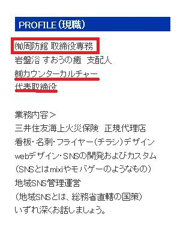
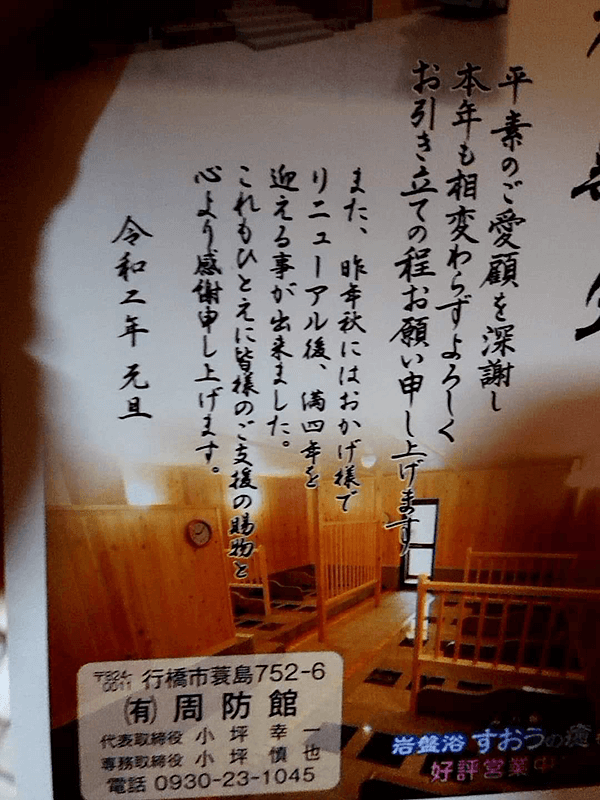

<h1>小坪慎也氏（行橋市議）の公有地不法占拠は百状委員会です</h1>

この記事は下記構成となっております。

  1. [小坪家の公有地不法占拠とは](#sec1)  
  2. [本人は「百条委員会ではない」と主張](#sec2)  
  3. [行橋市議会に見解を確認](#sec3)  
  4. [まとめ](#sec4)  

## 1. 小坪家の公有地不法占拠とは 
### 1-1. 小坪議員に設置された百条委員会  
行橋市の小坪慎也議員にかけられている百条委員会（39年ぶり）の概略とは 

  * 小坪家が国有の護岸を**無許可で埋立てて海岸線を変形**  
  * さらに、市有地を周防館（小坪家が運営）が占拠  
  
つまり、国有地＆市有地の不法占拠（違法行為）を行っていた。  
**さらなる詳細は「[始まりは１枚の怪文書から始まった#小坪家の犯罪](https://okmksato.github.io/matome/docs/01-kotsubo/dragon001.html)」をご覧ください。**

### 1-2. 百条委員会設置の重み  
<blockquote class="twitter-tweet" data-lang="ja">
全く違います。 百条委員会の重みは半端ないですよ！
&mdash; 田中がく@前貝塚市議会議員 (@tanakagaku_net) <a href="https://twitter.com/tanakagaku_net/status/1564605274047987714?ref_src=twsrc%5Etfw">2022年8月30日</a></blockquote>  

<blockquote class="box-quote">

百条委員会には、調査対象となっている関係者の出頭や証拠提出を求めることのできる「調査権」があり、正当な理由なく証言を拒んだりすると、禁錮や罰金が課せられる罰則規定があります。虚偽の証言を行ったときも同じです。

<cite><a href="https://kobeyamate.jp/2019/12/hyakujyo-iinkai-towa/" target="_blank">神戸山手法律事務所</a>」より引用</cite>
</blockquote>

## 2. 小坪議員は「百条委員会ではない」と主張  
### 2-1. 小坪議員の（代）弁
**本人的には「百条委員会でなく特別委員会」らしいので検証したいと思います。**  
小坪議員、何故か第三者を介して伝える。Twitterスレは覗いている（本人のイイネ確認済）。  

<blockquote class="twitter-tweet" data-lang="ja">
百条委員会については、本人では無くお父さんの件だったようですね！ ですが、実際は百条委員会は、行われて無いそうです。
&mdash; 田中がく@前貝塚市議会議員 (@tanakagaku_net) <a href="https://twitter.com/tanakagaku_net/status/1564598389144137728?ref_src=twsrc%5Etfw">2022年8月30日</a></blockquote> 

<blockquote class="twitter-tweet" data-conversation="none" data-lang="ja">
ですが、議会では根拠が乏しいとなってるそうです。 本当に根拠が鮮明なら特別委員会にならず、百条委員会になってます。
&mdash; 田中がく@前貝塚市議会議員 (@tanakagaku_net) <a href="https://twitter.com/tanakagaku_net/status/1564605710582788104?ref_src=twsrc%5Etfw">2022年8月30日</a></blockquote>  

### 2-2. 数々の矛盾点の指摘
  * 当時、小坪慎也氏は周防館の専務であった。父親の件でなく当時者である。

  
  * 百条委員会は行われており、継続中である。  
  * 占有地にあった小坪議員の選挙事務所（蓑島835-1）  
  現在プレハブは撤去、ロープをはって出入りできないようになっている模様。
<blockquote class="twitter-tweet" data-conversation="none" data-lang="ja">
ん？ 2枚目の写真。 以前そこにキン肉マンハウスみたいな建物があったと思うんですが、やはり台風の影響で吹っ飛んだんですか？ それともボヤでも起こしたのかな？ <a href="https://t.co/3l6AAakd6d">pic.twitter.com/3l6AAakd6d</a>
&mdash; MINO (@MINO70635329) <a href="https://twitter.com/MINO70635329/status/1565988463920365569?ref_src=twsrc%5Etfw">2022年9月3日</a></blockquote>  

## 3. 行橋市議会に見解を確認  
市議会や広報誌、新聞いずれも「百条委員会」と明言しています。  
### 3-1. 行橋市議会に直接確認  
<blockquote class="twitter-tweet" data-lang="ja">
私「小坪さんと言う方が行橋市議会で百条委員会は根拠が乏しくされていないと主張されているそうですがそれは事実ですか？」 事「それは事実ではありません百条に基づく特別委員会は設置され開催されています。」  令和4年行橋市議会3月定例会議事録を添付します。<a href="https://twitter.com/hashtag/%E3%83%96%E3%83%AB%E3%83%BC%E3%83%AA%E3%83%9C%E3%83%B3%E3%82%92%E5%AE%88%E3%82%8B%E8%AD%B0%E5%93%A1%E3%81%AE%E4%BC%9A?src=hash&amp;ref_src=twsrc%5Etfw">#ブルーリボンを守る議員の会</a> <a href="https://t.co/M8KkmWAPgH">pic.twitter.com/M8KkmWAPgH</a>
&mdash; もふもふ (@origin_0023) <a href="https://twitter.com/origin_0023/status/1565497488597225472?ref_src=twsrc%5Etfw">2022年9月2日</a></blockquote>  

<blockquote class="twitter-tweet" data-lang="ja">
で、徳永市議に確認しました。「今の特別委員会は、１００条委員会と言って間違いはありません。市職員は、慎重に質問に答えてます。」だそうです。必要に応じて委員会へ呼び出しがあるそうです。
&mdash; 李　小龍（闇の猫力） (@DragonCombo777) <a href="https://twitter.com/DragonCombo777/status/1566805933191114753?ref_src=twsrc%5Etfw">2022年9月5日</a></blockquote> 

### 3-2. 広報誌や議事録を確認  
<blockquote class="twitter-tweet" data-lang="ja">
会議録 行橋市 令和３年１２月定例会（第９回） 12月23日－07号  ”公有地である蓑島８３５－１に民有地の建物の一部、約２．５３平方メートルが境界を越えて建っていること、またアスファルト舗装等についても公有地を越境していることが判明しました。”<a href="https://t.co/wae53QRD4v">https://t.co/wae53QRD4v</a> <a href="https://t.co/8998Badgch">pic.twitter.com/8998Badgch</a>
&mdash; Dan Belushi (@DanBelushi) <a href="https://twitter.com/DanBelushi/status/1565946451708235777?ref_src=twsrc%5Etfw">2022年9月3日</a></blockquote>  

<blockquote class="twitter-tweet" data-lang="ja">
ゆくはし市議会だより　No.160 （令和４年３月行橋市議会定例会・４月行橋市議会臨時会・発行日/Ｒ4年6月1日）  &quot;３月１日付けで地方自治法第１００条第１項に基づいた記録の提出について、弁護士を通じて県に対し請求しました。&quot;<a href="https://t.co/WiZXKtYr58">https://t.co/WiZXKtYr58</a> <a href="https://t.co/85HVSqced1">pic.twitter.com/85HVSqced1</a>
&mdash; Dan Belushi (@DanBelushi) <a href="https://twitter.com/DanBelushi/status/1565951485753819136?ref_src=twsrc%5Etfw">2022年9月3日</a></blockquote>  

### 3-3. 毎日新聞の記事  
2021年10月1日の地方版掲載： [行橋市議会　市有地境界巡る百条委設置可決　／福岡](https://mainichi.jp/articles/20211001/ddl/k40/010/311000c){:target="_blank"}  

## 4. まとめ  
### 4-1. まとめ  
  * 日本の国土の海岸線は一部を除き国有地であり国が管理。その地形を変えて占有という犯罪行為。  
  * さらに**占有地に小坪議員の選挙事務所**も建造    
  * 特別委員会ではなく「百条委員会」であり、現在も継続中。
  
### 4-2. 巨大ブーメランか！？  
小坪議員は他議員の市有地不正利用を厳しく追求。さぁ、小坪議員の番です！  
※小坪議員の方が悪質・規模大です。  
<blockquote class="twitter-tweet" data-conversation="none" data-lang="ja">
【小坪ファミリーの犯罪】小坪慎也市議が、議会で追及したT市議の小さな家庭菜園より非常に悪質。議員辞職必至💢😠💢 <a href="https://t.co/ZY8q2gJnso">pic.twitter.com/ZY8q2gJnso</a>
&mdash; 新党ももくり (@momokuri3jiji) <a href="https://twitter.com/momokuri3jiji/status/1415422047119757313?ref_src=twsrc%5Etfw">2021年7月14日</a></blockquote>  
