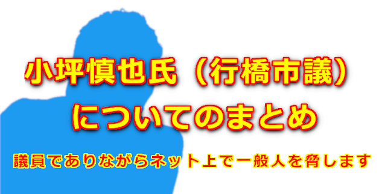

# 議員でありながらネット上で一般人を脅します  

twitter でう〜ちゃんさんが『小坪さんよ、添田氏発言取り消したいってよ。』と事実を述べたにも関わらず、小坪氏は『うそ』と決めつけ口汚い言葉で、う〜ちゃんさんを執拗に脅し続けました。  
小坪氏は行橋市の市会議員です。  
社会的責任のある立場です。  
この様な振る舞いは決して許されません。  

**添田市議の『発言取り消し』については別記事**  
 [添田詩織市議の一般質問に対する謝罪及び反省を求める決議について](../030-soeda01/)  

を参考にしてください  

<blockquote class="twitter-tweet">
【ヘイト言論弾圧】中国に不安を感じる市民の声を一般質問で述べたことが「ヘイト発言」として添田しおり議員に、謝罪と反省を求める決議を泉南市議会が可決。<a href="https://t.co/AyCSPZVreH">https://t.co/AyCSPZVreH</a>   決議文がどれぐらい滅茶苦茶か解説しました。 これ、違法決議、または無法決議だと思う。  ひどいと思ったらRT
— 小坪慎也@行橋市議（トレンド１位） (@kotsubo48) <a href="https://twitter.com/kotsubo48/status/1552833703390646272?ref_src=twsrc%5Etfw">July 29, 2022</a></blockquote> 

<blockquote class="twitter-tweet" data-conversation="none">
小坪さんよ、添田氏発言取り消したいってよ。 このツイート削除したほうがいいんじゃねえのか？
— う〜ちゃん (@kZ9bgcX7QAOUmXC) <a href="https://twitter.com/kZ9bgcX7QAOUmXC/status/1552951844712108032?ref_src=twsrc%5Etfw">July 29, 2022</a></blockquote> 

<blockquote class="twitter-tweet" data-conversation="none">
本人に、貴殿のTweetのリンクを貼って「ほんと？」と聞いたら、「うそ」と言われておりますけれど。（いま。）  あなたは何をソースに議員の声を代弁されたのですか？教えてもらってもよろしいでしょうか？
— 小坪慎也@行橋市議（トレンド１位） (@kotsubo48) <a href="https://twitter.com/kotsubo48/status/1552977681847062528?ref_src=twsrc%5Etfw">July 29, 2022</a></blockquote> 

<blockquote class="twitter-tweet" data-conversation="none">
ウソつき。  あと、我々ね、議員全般に言えることだけど「勝手に意思をねじまげられて発信されること」をひどく嫌うから。  勝手に人の身分を名乗って肩ってんじゃねぇーよ。  迷惑がかかるから言えない？ はぁ？  こっちは議員の身分を騙られてるんだから、ウソつきの大元を示せよ、ソース出せ！
— 小坪慎也@行橋市議（トレンド１位） (@kotsubo48) <a href="https://twitter.com/kotsubo48/status/1553285206836387840?ref_src=twsrc%5Etfw">July 30, 2022</a></blockquote> 

<blockquote class="twitter-tweet" data-conversation="none">
ウソつき。  あと、我々ね、議員全般に言えることだけど「勝手に意思をねじまげられて発信されること」をひどく嫌うから。  勝手に人の身分を名乗って肩ってんじゃねぇーよ。  迷惑がかかるから言えない？ はぁ？  こっちは議員の身分を騙られてるんだから、ウソつきの大元を示せよ、ソース出せ！
— 小坪慎也@行橋市議（トレンド１位） (@kotsubo48) <a href="https://twitter.com/kotsubo48/status/1553285206836387840?ref_src=twsrc%5Etfw">July 30, 2022</a></blockquote> 

<blockquote class="twitter-tweet" data-conversation="none">
だったら、ガチのやり方、とろうか？  こっちは身分を騙られて、勝手に議員側の意思として発信されてるんだけど、ソースを示さないなら、やるよ？  まずは取り消して謝れよ。 で、捏造者の発信元を公開してくれる？  貴方が当然に果たすべき責務だよ。 放棄するなら、考えがある。
— 小坪慎也@行橋市議（トレンド１位） (@kotsubo48) <a href="https://twitter.com/kotsubo48/status/1553287616824754176?ref_src=twsrc%5Etfw">July 30, 2022</a></blockquote> 

<blockquote class="twitter-tweet" data-conversation="none">
ツイート信じてツイートしたことは謝まります。 これでよろしいですか。 不足があればいって下さい。
— う〜ちゃん (@kZ9bgcX7QAOUmXC) <a href="https://twitter.com/kZ9bgcX7QAOUmXC/status/1553288390858391552?ref_src=twsrc%5Etfw">July 30, 2022</a></blockquote> 

<blockquote class="twitter-tweet" data-conversation="none">
議員の意思を、誤ってウソをつかせた犯人を教えて。  公開で。
— 小坪慎也@行橋市議（トレンド１位） (@kotsubo48) <a href="https://twitter.com/kotsubo48/status/1553288592570880000?ref_src=twsrc%5Etfw">July 30, 2022</a></blockquote> 
