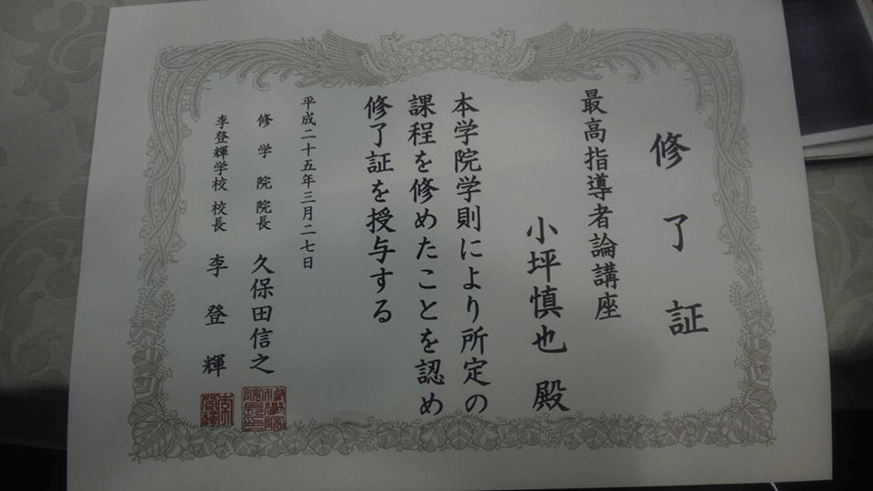

<h1>小坪慎也氏（行橋市議）の「自民党推薦」は自称？</h1>

この記事は下記構成となっております。

  1. [小坪議員による「支部による推薦」発言と推薦状](#sec1)  
  2. [小坪議員が欲しい自民党推薦状ってどんなの？](#sec2)  
  3. [矛盾・指摘など](#sec3)  
  4. [まとめ](#sec4)  

## 1. 小坪議員による「支部による推薦」発言と推薦状  
### 1-1. 小坪議員による言質  
「小選挙区支部（および地域支部）の手続き」であり、選挙時はポスターなどにロゴを貼っていたそうです。

<blockquote class="twitter-tweet">
ちなみに、私達の場合は、【自民福岡県連】の公認・推薦手続きではなく、小選挙区支部（および地域支部）の手続きになります。  仕組みをわかった上で、わざとデマ流してる？  ていうか、自民党ってロゴいれて普通にポスターとか貼って戦ったわけで、ネットでレッテル貼ってもリアルは変わらないのに。  &mdash; 小坪慎也🎌行橋市議（トレンド１位） (@kotsubo48) 
<a href="https://twitter.com/kotsubo48/status/1546019711452086272?ref_src=twsrc%5Etfw">2022年7月10日</a></blockquote> 

<blockquote class="twitter-tweet" data-lang="ja">
次に、推薦にもいくつかあり、県連推薦（この場合は福岡県連に掲載される）、政令市であれば市連がやる場合も。  私は、所属する福岡１１区支部の、さらに行橋支部で推薦を受け、推薦状を行橋支部長名で頂いています。 自民党の行橋支部のホームページはないため、ネットには掲載されないと思います。  &mdash; 小坪慎也🎌行橋市議（トレンド１位） (@kotsubo48) 
<a href="https://twitter.com/kotsubo48/status/1456432070901702657?ref_src=twsrc%5Etfw">2021年11月5日</a></blockquote> 

### 1-2. 小坪議員の推薦状の画像  

<blockquote class="twitter-tweet" data-lang="ja">
自民党の正式な推薦は「推薦証」ですね。 <a href="https://t.co/LmgUD7VnfU">https://t.co/LmgUD7VnfU</a> <a href="https://t.co/mbSp6FHP0p">pic.twitter.com/mbSp6FHP0p</a>  &mdash; 新党ももくり (@momokuri3jiji) <a href="https://twitter.com/momokuri3jiji/status/1564558280160346113?ref_src=twsrc%5Etfw">2022年8月30日</a>
</blockquote> 

  

疑問点

「貴殿」「行橋市議会」の途中で改行が入っていて不自然。書状作成する業者は必ず綺麗なところで改行するもの。 
署名も筆ぺんで書かれており、落款の位置も雑ですね。

## 2. 小坪議員が欲しい自民党推薦状ってどんなの？  
### 2-1. 正式な自民党推薦状です  
<blockquote class="twitter-tweet" data-conversation="none" data-lang="ja">
 <a href="https://t.co/2BhtyT3uXk">pic.twitter.com/2BhtyT3uXk</a>  &mdash; 田中がく@前貝塚市議会議員 (@tanakagaku_net) <a href="https://twitter.com/tanakagaku_net/status/1564927987174088704?ref_src=twsrc%5Etfw">2022年8月31日</a>
</blockquote>   

### 2-2. ツイッターでの数々の指摘
  * 行橋支部の橋本さんの<strong>個人推薦</strong>でしょ。  
  * 支部の推薦なら、なぜ「支部長」の肩書きが無いのかなと。🤔 こういう推薦状とかは、肩書きや役職って重要じゃないんですかね？  
  * 自民党の正式な推薦証には、中央に菊のエンブレムと落款は2ケ所あり。  
  * 講座修了証をわざわざブログ掲載してるのに、推薦状は載ってないんですね。何でだろう？

## 3. 矛盾・指摘など  
### 3-1. 福岡県議連への確認結果  
小坪議員の発言「福岡県連では、市町村議会議員の推薦状は、無い」→　<strong class="red">実際はある</strong>  
<blockquote class="twitter-tweet" data-lang="ja">
田中先生その情報は嘘です。 こちらは福岡県議会議員で福岡県連幹事長を務めた樋口明さんのブログです。 2020年の宗像市議会議員選挙にあたり6名の候補者に党の正式な推薦状が交付されています。  小坪議員が自民党の事を何も知らないか嘘をついているかのどちらかですね。<a href="https://t.co/nDQ4uhkCVz">https://t.co/nDQ4uhkCVz</a> <a href="https://t.co/RyXV0DZF5D">pic.twitter.com/RyXV0DZF5D</a>  &mdash; もふもふ (@origin_0023) 
<a href="https://twitter.com/origin_0023/status/1565145687943442432?ref_src=twsrc%5Etfw">2022年9月1日</a></blockquote>  

<blockquote class="twitter-tweet">
【新たな疑惑】小坪慎也（行橋）市議。推薦状を自作？小坪市議が北九州市議候補に出した推薦状と、自民党行橋支部長から貰った推薦状が酷似。 <a href="https://t.co/4ITxFN3Zdr">pic.twitter.com/4ITxFN3Zdr</a>  &mdash; 新党ももくり (@momokuri3jiji)
<a href="https://twitter.com/momokuri3jiji/status/1565564343525076992?ref_src=twsrc%5Etfw">September 2, 2022</a></blockquote> 

### 3-2. 福岡県議連に直接確認してみた  
<blockquote class="twitter-tweet" data-lang="ja">
コツボシンヤ、無いこと無いこと言いよる w 全部嘘やん。私、自民党福岡県連に電話確認したのよね。『推薦は出してません』これが事実。当然、書類など存在するはずがない。 <a href="https://t.co/i2GFX1ro8M">pic.twitter.com/i2GFX1ro8M</a>  &mdash; まるこサブ💙💛🍎🌛⭐🐢🐝🐢🐝🐢🐝🐢🐝🐢🐝🐢 (@Bluemoonnight02)
<a href="https://twitter.com/Bluemoonnight02/status/1536920085168029696?ref_src=twsrc%5Etfw">2022年6月15日</a></blockquote> 

<blockquote class="twitter-tweet" data-conversation="none">
小坪慎也市議は、自民党福岡県連や行橋市議会へ電話で確認したら自民党公認ではないとのこと。自分は自民党支持なので不快です。 返信ありがとうございます。 これからも応援してます。  &mdash; 宮本ワンコ (@PAWayEYtASp8tDx)
<a href="https://twitter.com/PAWayEYtASp8tDx/status/1561115612247511040?ref_src=twsrc%5Etfw">2022年8月20日</a></blockquote> 

## 4. まとめ  
### 4-1.  推薦状についての実態は？  
<blockquote class="twitter-tweet">
入党すれば、推薦公認関係なく自民党所属は名乗れると言うことを聞きました。 つまり、自民党所属→〇 自由民主党から推薦→×(自由民主党行橋支部から推薦)  こういうことかな？と思います。 つまり、自民党には所属しており行橋支部は推薦しているが、自民党の推薦候補者ではない。ですね！ <a href="https://t.co/OD76ytvUW5">pic.twitter.com/OD76ytvUW5</a>
&mdash; もふもふ (@origin_0023) <a href="https://twitter.com/origin_0023/status/1565332732682866689?ref_src=twsrc%5Etfw">September 1, 2022</a></blockquote>  

<blockquote class="twitter-tweet" data-lang="ja">
党の中の地域支部の推薦状は簡単に言えば老人会とか自治会の推薦状に近いそうです。 地域支部ごとに会議手法が違うのでどうやって推薦出してるかは知らない。 会議が年一回くらいしかない幽霊みたいな地域支部も全国にはある。行橋の事は知りません。だそうです。
&mdash; もふもふ (@origin_0023) <a href="https://twitter.com/origin_0023/status/1564961987972722688?ref_src=twsrc%5Etfw">2022年8月31日</a></blockquote> 

<blockquote class="twitter-tweet" data-lang="ja" style="margin-bottom:40px;">
大事な事は自民党議員を名乗るなら、その市町や市町議会において自民党議員としての仕事をきちんとしているか？ その職責を果たしているか？ という事も説明を受け、なるほどと思った次第です。  福岡県自民党政策集もございますし。<a href="https://t.co/woPVSstZyQ">https://t.co/woPVSstZyQ</a>
&mdash; 川十郎 (@take55furukabu) <a href="https://twitter.com/take55furukabu/status/1564970807574401026?ref_src=twsrc%5Etfw">2022年8月31日</a></blockquote>  

  * 小坪議員の推薦状は正式な様式と全く異なる（自作した推薦状に一般人である支部長サインをもらっただけ）。  
  * 自民党所属議員ではなく、自民党一般党員（党費4,000円支払うとなれる）の議員である。  
  * 自民党福岡県連の回答では、推薦・公認は一切していないとのこと。  
  * 小坪議員から自民党への片想いラブストーリー。  
  * 講座修了証すらわざわざブログに掲載しているのに、推薦状をアップしていないのは何故なのか？  
    
  
**因みに、議員の手腕が買われると自民党側からスカウトされるみたいです。猛烈アプローチしなくても。**
