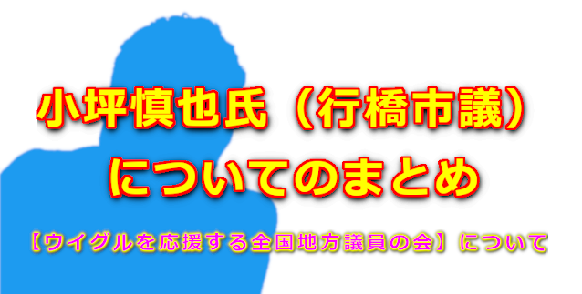

# 【ウイグルを応援する全国地方議員の会】について②  

川十郎 さん [@take55furukabu](https://twitter.com/take55furukabu)

**[【ウイグルを応援する全国地方議員の会】について](https://twitter.com/take55furukabu/status/1554344697581404160)**

**在日ウイグル人のトゥールムハメットさん [@etman09](https://twitter.com/etman09) への誹謗中傷について**  

<blockquote class="twitter-tweet" data-conversation="none">
在日ウイグル人の <a href="https://twitter.com/hashtag/%E3%83%88%E3%82%A5%E3%83%BC%E3%83%AB%E3%83%A0%E3%83%8F%E3%83%A1%E3%83%83%E3%83%88?src=hash&amp;ref_src=twsrc%5Etfw">#トゥールムハメット</a> さん<a href="https://t.co/C7hzwoTHDE">https://t.co/C7hzwoTHDE</a>
&mdash; 川十郎 (@take55furukabu) <a href="https://twitter.com/take55furukabu/status/1554344697581404160?ref_src=twsrc%5Etfw">August 2, 2022</a></blockquote> 

<blockquote class="twitter-tweet" data-conversation="none">
在日ウイグル人の <a href="https://twitter.com/hashtag/%E3%83%88%E3%82%A5%E3%83%BC%E3%83%AB%E3%83%A0%E3%83%8F%E3%83%A1%E3%83%83%E3%83%88?src=hash&amp;ref_src=twsrc%5Etfw">#トゥールムハメット</a> さんの訴えです。<a href="https://t.co/6WuvdoM7Db">https://t.co/6WuvdoM7Db</a>
&mdash; 川十郎 (@take55furukabu) <a href="https://twitter.com/take55furukabu/status/1554345717573242881?ref_src=twsrc%5Etfw">August 2, 2022</a></blockquote> 

<blockquote class="twitter-tweet" data-conversation="none">
在日ウイグル人の <a href="https://twitter.com/hashtag/%E3%83%88%E3%82%A5%E3%83%BC%E3%83%AB%E3%83%A0%E3%83%8F%E3%83%A1%E3%83%83%E3%83%88?src=hash&amp;ref_src=twsrc%5Etfw">#トゥールムハメット</a> さんの訴えです③<a href="https://t.co/fEO9xVhLAg">https://t.co/fEO9xVhLAg</a>
&mdash; 川十郎 (@take55furukabu) <a href="https://twitter.com/take55furukabu/status/1554346914333982720?ref_src=twsrc%5Etfw">August 2, 2022</a></blockquote> 

<blockquote class="twitter-tweet" data-conversation="none">
在日ウイグル人の <a href="https://twitter.com/hashtag/%E3%83%88%E3%82%A5%E3%83%BC%E3%83%AB%E3%83%A0%E3%83%8F%E3%83%A1%E3%83%83%E3%83%88?src=hash&amp;ref_src=twsrc%5Etfw">#トゥールムハメット</a> さんの訴えです④<a href="https://t.co/vXctClsUfH">https://t.co/vXctClsUfH</a>
&mdash; 川十郎 (@take55furukabu) <a href="https://twitter.com/take55furukabu/status/1554348702986534912?ref_src=twsrc%5Etfw">August 2, 2022</a></blockquote> 

<blockquote class="twitter-tweet" data-conversation="none">
「<a href="https://twitter.com/hashtag/%E6%97%A5%E6%9C%AC%E3%81%A7%E3%81%AE%E3%82%A6%E3%82%A4%E3%82%B0%E3%83%AB%E4%BA%BA%E6%A8%A9%E6%B3%95%E3%81%AE%E6%88%90%E7%AB%8B%E3%82%92%E6%B1%82%E3%82%81%E3%82%8B%E8%AB%8B%E9%A1%98?src=hash&amp;ref_src=twsrc%5Etfw">#日本でのウイグル人権法の成立を求める請願</a>」署名活動をされた御方の嘆きです。 当時署名をした人達の想いの代弁でもあると個人的に思っています😢 日本人としてトゥールさんに申し訳なかった。 （添田詩織泉南市議会議員は答えず逃げた。）<a href="https://t.co/EzzsgFzQdi">https://t.co/EzzsgFzQdi</a>
&mdash; 川十郎 (@take55furukabu) <a href="https://twitter.com/take55furukabu/status/1554350790722334721?ref_src=twsrc%5Etfw">August 2, 2022</a></blockquote> 

<blockquote class="twitter-tweet" data-conversation="none">
【<a href="https://twitter.com/hashtag/%E5%9C%A8%E6%97%A5%E3%82%A6%E3%82%A4%E3%82%B0%E3%83%AB%E4%BA%BA%E3%83%88%E3%82%A5%E3%83%BC%E3%83%AB%E3%81%95%E3%82%93%E3%81%AB%E5%AF%BE%E3%81%99%E3%82%8B%E8%AA%B9%E8%AC%97%E4%B8%AD%E5%82%B7%E3%81%AB%E3%81%A4%E3%81%84%E3%81%A6?src=hash&amp;ref_src=twsrc%5Etfw">#在日ウイグル人トゥールさんに対する誹謗中傷について</a>】 スレッド内のtweetの一部訂正あります。 「公安」という表現👉正しくは「警察の警備」です。<a href="https://t.co/rz61wZbW1B">https://t.co/rz61wZbW1B</a>
&mdash; 川十郎 (@take55furukabu) <a href="https://twitter.com/take55furukabu/status/1554359666192576512?ref_src=twsrc%5Etfw">August 2, 2022</a></blockquote> 

<blockquote class="twitter-tweet" data-conversation="none">
【<a href="https://twitter.com/hashtag/%E5%9C%A8%E6%97%A5%E3%82%A6%E3%82%A4%E3%82%B0%E3%83%AB%E4%BA%BA%E3%83%88%E3%82%A5%E3%83%BC%E3%83%AB%E3%81%95%E3%82%93%E3%81%AB%E5%AF%BE%E3%81%99%E3%82%8B%E8%AA%B9%E8%AC%97%E4%B8%AD%E5%82%B7%E3%81%AB%E3%81%A4%E3%81%84%E3%81%A6?src=hash&amp;ref_src=twsrc%5Etfw">#在日ウイグル人トゥールさんに対する誹謗中傷について</a>】 再度、訂正部分を記載します。 ↓このtweetの「公安」という部分、正しくは「警察の警備」です。<a href="https://t.co/8SOadlIlxy">https://t.co/8SOadlIlxy</a>
&mdash; 川十郎 (@take55furukabu) <a href="https://twitter.com/take55furukabu/status/1554360228942352389?ref_src=twsrc%5Etfw">August 2, 2022</a></blockquote> 

<blockquote class="twitter-tweet" data-conversation="none">
<a href="https://twitter.com/hashtag/%E6%97%A5%E6%9C%AC%E3%81%A7%E3%81%AE%E3%82%A6%E3%82%A4%E3%82%B0%E3%83%AB%E4%BA%BA%E6%A8%A9%E6%B3%95%E3%81%AE%E6%88%90%E7%AB%8B%E3%82%92%E6%B1%82%E3%82%81%E3%82%8B%E8%AB%8B%E9%A1%98?src=hash&amp;ref_src=twsrc%5Etfw">#日本でのウイグル人権法の成立を求める請願</a> 請願提出までの事を時系列で解るスレッドです。<a href="https://t.co/FhRlC2e3rG">https://t.co/FhRlC2e3rG</a>
&mdash; 川十郎 (@take55furukabu) <a href="https://twitter.com/take55furukabu/status/1554361210749198342?ref_src=twsrc%5Etfw">August 2, 2022</a></blockquote> 

<blockquote class="twitter-tweet" data-conversation="none">
「ウイグルを応援する全国地方議員の会」の件 ↓（上下にスレッドがあります）<a href="https://t.co/BvNfiP6itf">https://t.co/BvNfiP6itf</a>
&mdash; 川十郎 (@take55furukabu) <a href="https://twitter.com/take55furukabu/status/1554363135850840065?ref_src=twsrc%5Etfw">August 2, 2022</a></blockquote> 

<!--

<blockquote class="twitter-tweet" data-conversation="none">
<a href="https://twitter.com/hashtag/%E8%A9%B1%E3%81%8C%E9%A3%9B%E3%81%B3%E3%81%BE%E3%81%99%E3%81%8C?src=hash&amp;ref_src=twsrc%5Etfw">#話が飛びますが</a>。未成年だが容赦しない？ 人生を叩き潰すところまでやった？一家離散？ 😱なにこれ、滅茶苦茶です。その子は大丈夫？ 議員以前に大人のやる事ですか？<a href="https://t.co/jNLxmCoIgL">https://t.co/jNLxmCoIgL</a>
&mdash; 川十郎 (@take55furukabu) <a href="https://twitter.com/take55furukabu/status/1554365284009791488?ref_src=twsrc%5Etfw">August 2, 2022</a></blockquote> 

<blockquote class="twitter-tweet" data-conversation="none">
140字以内で簡単に纏めるとこうなります。<a href="https://t.co/BJptksiXkx">https://t.co/BJptksiXkx</a>
&mdash; 川十郎 (@take55furukabu) <a href="https://twitter.com/take55furukabu/status/1554374062067142659?ref_src=twsrc%5Etfw">August 2, 2022</a></blockquote> 

<blockquote class="twitter-tweet" data-conversation="none">
ぜひ、質問に答えて欲しい。<a href="https://t.co/1Qci3z62Gz">https://t.co/1Qci3z62Gz</a>
&mdash; 川十郎 (@take55furukabu) <a href="https://twitter.com/take55furukabu/status/1554624532878528512?ref_src=twsrc%5Etfw">August 3, 2022</a></blockquote> 

-->
