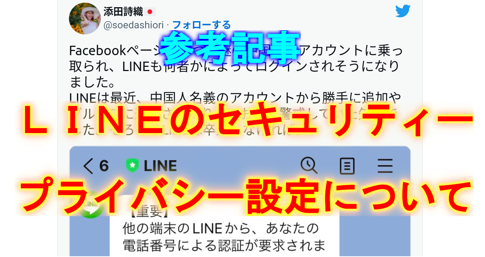
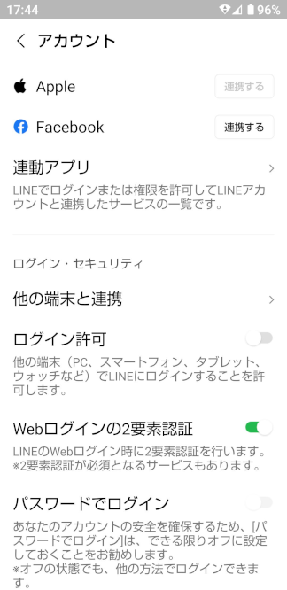
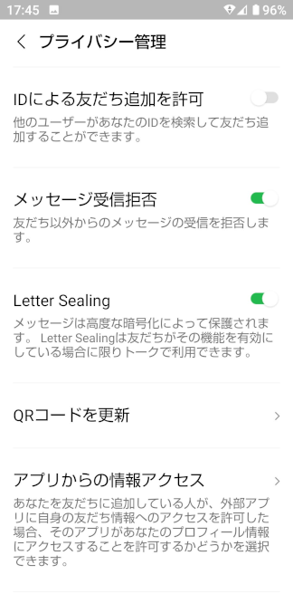
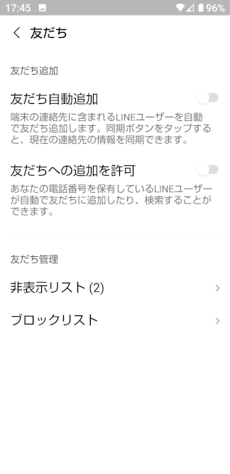
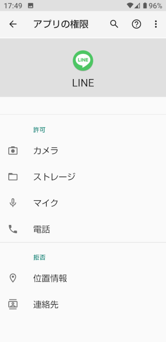

# 【参考記事】LINEのセキュリティー、プライバシー設定について

添田市議の記事が意外と反響がありましたのでLINEのセキュリティー、プライバシーの設定について簡単に説明させていただきます [@okmksato](http://twitter.com/okmksato/)

添田市議のこのツイート

<blockquote class="twitter-tweet">
Facebookページも２つ、謎の中国語のアカウントに乗っ取られ、LINEも何者かによってログインされそうになりました。 LINEは最近、中国人名義のアカウントから勝手に追加やグループに追加されたりしており、警戒していた矢先でした。そろそろLINEは卒業しなければ。 <a href="https://t.co/TZJtTcIuAc">pic.twitter.com/TZJtTcIuAc</a>
&mdash; 添田詩織🇯🇵 (@soedashiori) <a href="https://twitter.com/soedashiori/status/1554084460542701570?ref_src=twsrc%5Etfw">August 1, 2022</a></blockquote> 

 
Facebook のページが2つ乗っ取られ、LINE も乗っ取り未遂のような被害を受けたと言う事ですが  
何故か乗っ取られたFacebookについては何も言及せず、LINE のみ『卒業』を検討されています  

このお話だけだと Facebook の方が危なそうで両方卒業された方が良いのではないかと思ってしまいます  

しかし LINE だけでなく Facebook でも被害を受けたのであれば、**LINE、中国人と騒ぐ以前の問題**の可能性が高いです

Facebook については

1. 単純なパスワードは使わない
2. 他のアカウントとパスワードの使い回しはしない
3. 2段階認証を使用

特に『2段階認証』は強力で仮にパスワードを知られてしまっても、パソコンがウイルスに感染していても、スマホを盗まれでもしない限り乗っ取りはできません

- もちろんパスワードが流出した形跡があればすみやかに変更しましょう
- パソコンがウイルスに感染した恐れがあるならリカバリー（初期化）するのが無難です
- OSのアップデートなど基本的なメンテナンスを行いましょう

※ ２段階認証を使用すれば完全に安全と言う訳ではありません、複数の対策を組み合わせるのが大切です

 
**次に本題の LINE についてです**

LINE で誰かにログインされそうになるのはスマホ以外の機器でログインできる設定になっているからです  
`ログイン許可` はＯＦＦにしておきましょう

以下、私のLINE の設定の一部を紹介します

 
`ログイン許可` ＯＦＦ    
パソコンでLINEを使う時はその都度設定を変えています  

`ID による友だち追加を許可` ＯＦＦ  

`友だち自動追加` ＯＦＦ  
`友だちへの追加を許可` ＯＦＦ  

さらに私は**アプリ権限**で

`位置情報` 拒否  
`連絡先` 拒否  

一般人なら、LINE については  
これで、ほぼほぼ大丈夫です

これより、緩い設定の方が多いと思いますが LINE に限らず商業ベースのSNSは個人情報が漏れるものと割り切って使う必要があります  

万が一、漏れて公になってしまったとして、この内容は大丈夫？  
と、ほんの少し意識しましょう

冗談であっても犯罪予告など反社会的な言動は避けましょう  

国家や企業の重要な機密のやり取りに使うのは危険です  

ハニートラップで狙われるような偉い方も要注意です  

不倫相手との恥ずかしい会話、恥ずかしい写真とか・・・楽しそうですがダメですよ

 

 
以上の様な事を踏まえた上で行政機関が利用する情報ツールとして LINE がふさわしいのかどうかについて、冷静に検証する必要があります

添田市議に次の事をお願いしたいです

- 不安をあおるだけでなく、様々な分野の専門家の意見を仰いでいただき、LINE の扱いについて議会に提案していただきたいと思います
- スマホやパソコンを安全に利用する為に必要な知識を市民に広げる取り組みにも取り組んでいただきたい
