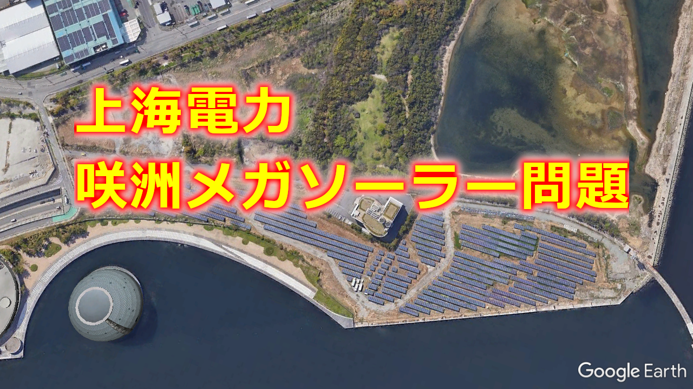

# 咲洲メガソーラーは地方自治法違反
  

<iframe width="320" height="320" src="https://www.youtube.com/embed/-vepgN-1PkE" title="YouTube video player" frameborder="0" allow="accelerometer; autoplay; clipboard-write; encrypted-media; gyroscope; picture-in-picture" allowfullscreen></iframe>
 

動画ナレーション

>咲洲（さきしま）、メガソーラーの土地は、緑地予定地で大阪市の行政財産です。  
国の法律である地方自治法238条の4、第1項において、行政財産は売却や貸出は原則禁止とされています。  
第2項において、例外として貸出ができる条件が定められています。  
緑地予定地の行政財産を貸出すためには。  
本来の緑地としての目的を妨げない事が条件になります。  
また、休憩所、売店など、緑地としての利便性を高める施設でなければなりません。  
営利目的のメガソーラーなど到底許されません。  
地方自治法に違反する、咲洲、メガソーラーは直ちに撤去し、緑地の整備再開を求めます。


