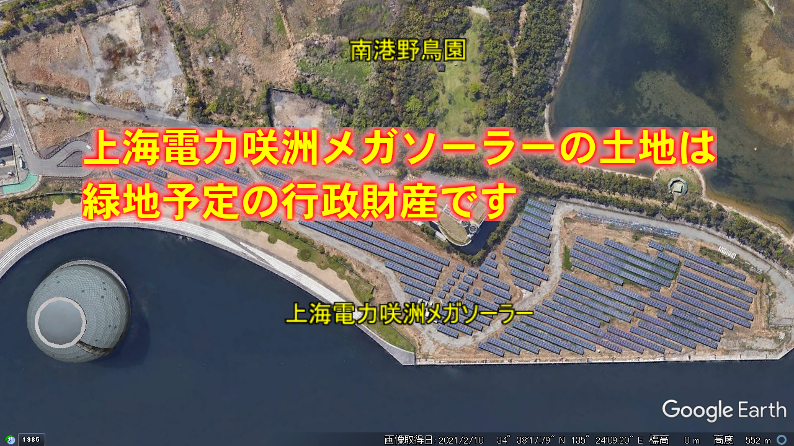
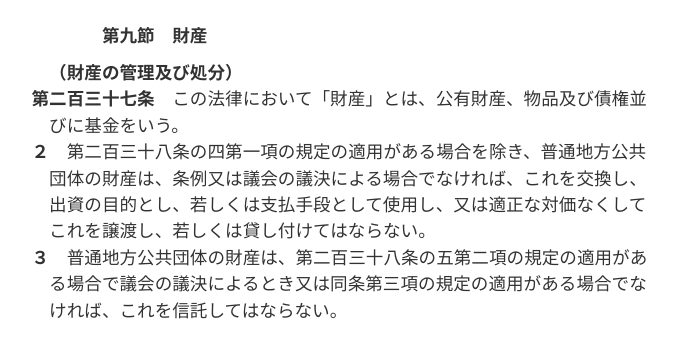
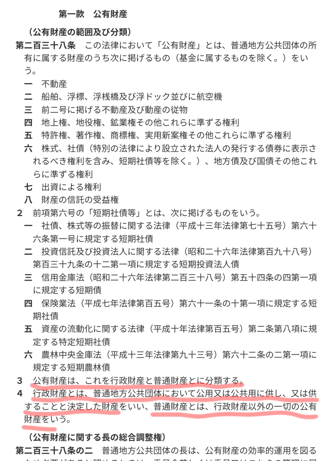
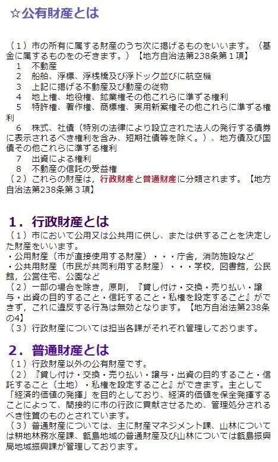
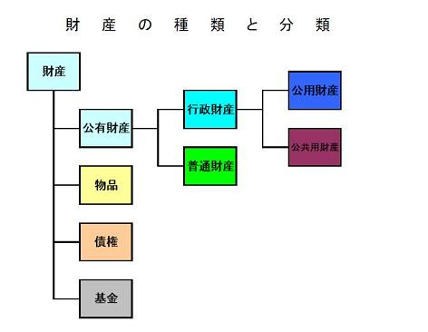

# 上海電力咲洲メガソーラーの土地は緑地予定の行政財産です  

## 上海電力咲洲メガソーラーの土地は大阪市所有の『緑地』行政財産であり民間への貸出しは原則禁止されています

地方自治体の財産に関するルールは

国の法律である**地方自治法第九節 財産**に定められています

地方自治法  
⇒ 第二編 普通地方公共団体  
⇒ 第九章 財務  
⇒ [第九節 財産](https://elaws.e-gov.go.jp/document?lawid=322AC0000000067#Mp-Pa_2-Ch_9-Se_9)

[▼ 資料参照](#資料地方自治法第九節財産)

 
行政財産については鹿児島県薩摩川内市のホームページにわかりやすい解説があります
  
鹿児島県薩摩川内市HP [公有財産（普通財産・行政財産）とは](https://www.city.satsumasendai.lg.jp/www/contents/1217826133671/index.html)  

[▼ 資料参照](#資料鹿児島県薩摩川内市hp)

 
**公有財産**は
- **行政財産**
- **普通財産**

に分類されます

 
**行政財産**とは

1. 市において**公用又は公共用に供し、または供する**ことを決定した財産
 - 公用財産（市が直接使用する財産）
  - 庁舎，消防施設など
 - 公共用財産（市民が共同利用する財産）
  - 学校，図書館，公民館，公営住宅、**公園**など
2. 一部の場合を除き**原則『貸したり・売ったり』ができません**
 - これに**違反する行為は無効**となります。**地方自治法第238条の4**

 
**普通財産**とは
1. **行政財産以外**の公有財産です。
2. **『貸したり、売ったり』ができます**
- 主として「**経済的価値の発揮**」が目的
- 経済的価値を保全発揮することによって、間接的に市の行政に貢献させるため、管理処分されるべき性質のもの

 
上海電力咲洲メガソーラーの土地は大阪市の土地ですが  
- もし**普通財産**であれば民間であっても貸出す事ができます
- もし**普通財産**であれば地方自治法の財産規定における問題は生じません

ただし『普通財産であれば貸出自由』とはあくまでも地方自治法おける制約がないという事で  
- [用途地域](https://www.city.osaka.lg.jp/toshikeikaku/page/0000005121.html)などの規制には従う必要があります  
- 行政による貸出しですので、公募手続き、利用目的等はそれにふさわしいものが求められます

 
しかし、上海電力咲洲メガソーラの土地は**緑地**であり**行政財産**です
一部の場合を除き**原則『貸したり、売ったり』ができません**  

- 行政財産を**売却**できる法的枠組みはありません。一部の例外において**貸出**のみ認められます  

 
また、行政財産の規定は**公用又は公共用に供することを決定**した財産にも適用されるのは重要なポイントです

つまり、まだ完成していない計画地であっても本来の用途以外での利用はできません

上海電力咲洲メガソーラーについては「未整備の土地だから有料で貸し出して有効活用した」と、まことしやかに言われていますが  
- 緑地として未整備である事が、民間企業に貸し出す事ができる根拠にはなりません
- たとえ未整備であったとしても、行政財産の貸出は原則禁止です
- 緑地の整備は進行中で『未整備』は事実でありませんでした
- 貸出す場合は、法的に認められた『一部の場合』の条件を満たす必要があります

そもそも、大阪市の公有財産に『未整備地』なる分類は存在しません  
使い道がない、いわゆる『遊休地』は『未利用地』として管理されています

[【参考】大阪市未利用地情報](https://www.city.osaka.lg.jp/keiyakukanzai/page/0000006945.html)  

上海電力咲洲メガソーラーの土地がこのような『未利用地』に分類され、普通財産に付け替える手続き等が行われたのであれば、公有財産としての手続き上の問題は生じません

本来、役所はこのような「たてまえ」にこだわりながら物事を進めていくものですが、上海電力咲洲メガソーラーに関しては異様なほど「いいかげんさ」が目立ちます

引き続き、行政財産としての上海電力咲洲メガソーラーの問題について、検証していきます

なお、地方自治法の規定に基づき各自治体がより具体化した財産条例などを定めていますが、地方自治法違反の事例が条例では容認される様な事はありません    
資料によっては、各自治体の条例や各省庁の法令、通知等が引用されていますが、地方自治法の解釈事例としてご理解願います

 

## 【資料】地方自治法第九節財産

地方自治法  
⇒ 第二編 普通地方公共団体  
⇒ 第九章 財務  
⇒ [第九節 財産](https://elaws.e-gov.go.jp/document?lawid=322AC0000000067#Mp-Pa_2-Ch_9-Se_9)

  

 

## 【資料】鹿児島県薩摩川内市HP

鹿児島県薩摩川内市HP  
[公有財産（普通財産・行政財産）とは](https://www.city.satsumasendai.lg.jp/www/contents/1217826133671/index.html)  

