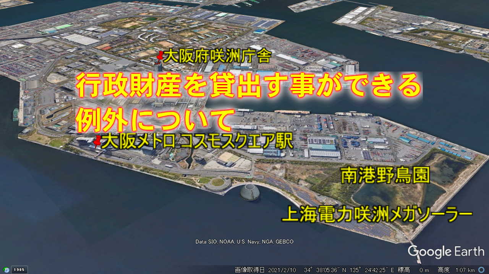
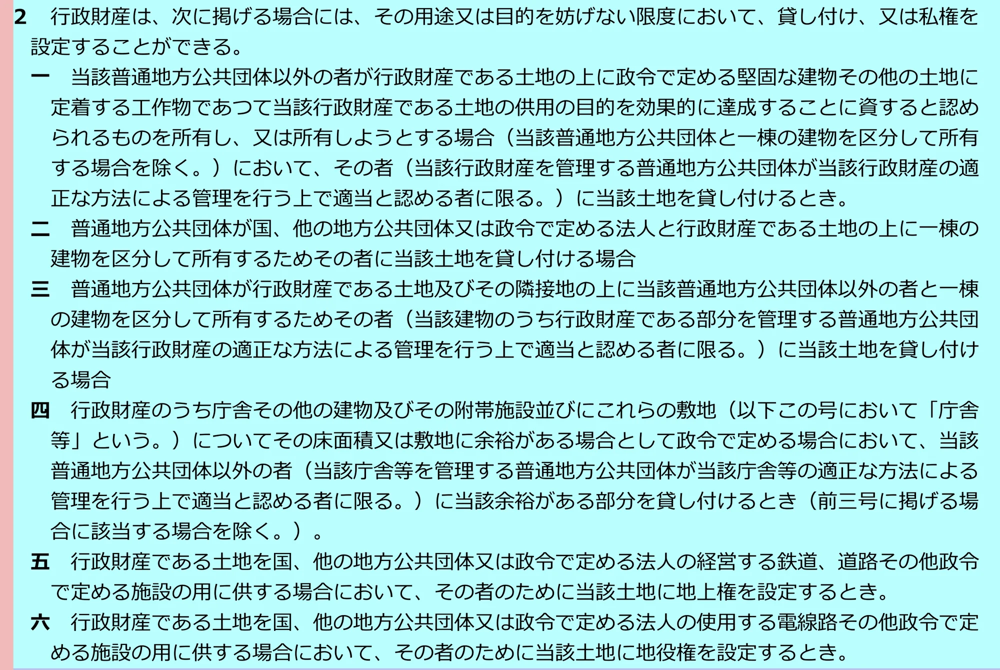

# 行政財産を貸出す事ができる例外について  

地方自治体の行政財産の管理に関するルールは  
[地方自治法第二百三十八条の四（行政財産の管理及び処分）](https://elaws.e-gov.go.jp/document?lawid=322AC0000000067_20220601_503AC0000000050#Mp-At_238_4)で規定されています

地方自治法第二百三十八条の四第一項

>（行政財産の管理及び処分）
第二百三十八条の四　行政財産は、**次項から第四項までに定めるもの**を除くほか、これを貸し付け、交換し、売り払い、譲与し、出資の目的とし、若しくは信託し、又はこれに私権を設定することができない。

**次項（第二項）から第四項までに定めるもの**以外は、行政財産の貸出しは禁止されています

これに、違反すれば、その契約は無効となります

地方自治法第二百三十八条の四第六項

>６　第一項の規定に違反する行為は、これを無効とする。

したがって上海電力咲洲メガソーラーが**次項（第二項）から第四項までに定めるもの**に該当しなければ契約は無効です

**次項（第二項）から第四項までに定めるもの**のうち第三項、第四項は事業継承についての記述ですので**第二項の第一号から第六号に定められた条件が行政財産を貸出す事ができる特例の条件**となります

名古屋市の**[『第4．公有財産の貸付及び目的外使用許可に関して』（PDFファイル）](https://www.city.nagoya.jp/kansa/cmsfiles/contents/0000032/32767/h23_hokatsu_honbun03.pdf)3ページ**では次のように分類されています

>（２）行政財産の貸付 地方自治法第 238 条の４第２項（抄）  
第一号 土地を効果的に利用させるための民間建物の敷地の貸付け  
第二号 公共団体などとの合築建物における敷地の貸付け  
第三号 隣接した民間との合築建物における敷地の貸付け  
第四号 庁舎等に余裕がある場合の貸付け  
第五号 鉄道、道路等への地上権の設定  
第六号 電線等への地役権設定

 
第二号から第四号は他の公共団体や民間と複合施設や庁舎等をシェアする場合の規定です  
この場合、行政財産の本来の目的を満たせるだけの施設や空間などの条件が満たされていれば、民間等とシェアしている部分については**行政財産本来の目的以外での活用も認められています**

- 例えば低層は庁舎、高層は宿泊施設など、庁舎本来の目的外での活用も可能です  

>第二号 公共団体などとの合築建物における敷地の貸付け  
第三号 隣接した民間との合築建物における敷地の貸付け  
第四号 庁舎等に余裕がある場合の貸付け  

 
第五号、第六号は施設に必要なインフラ設備の設置に関する規定です

>第五号 鉄道、道路等への地上権の設定  
第六号 電線等への地役権設定  

 
第二号から第六号は上海電力咲洲メガソーラーには適合しません  
（上海電力咲洲メガソーラーは施設のシェアでも施設に必要なインフラ設備でもありません）

 
残る第一号について検証します

>第一号 土地を効果的に利用させるための民間建物の敷地の貸付け  

 
太陽光発電メガソーラーの設置は**土地を効果的に利用**に相当するのでしょうか

第一号の原文を確認します

>一　当該普通地方公共団体以外の者が行政財産である土地の上に政令で定める堅固な建物その他の土地に定着する工作物であつて当該行政財産である土地の供用の目的を効果的に達成することに資すると認められるものを所有し、又は所有しようとする場合（当該普通地方公共団体と一棟の建物を区分して所有する場合を除く。）において、その者（当該行政財産を管理する普通地方公共団体が当該行政財産の適正な方法による管理を行う上で適当と認める者に限る。）に当該土地を貸し付けるとき。

第一号では第二号から第六号にはない、次の条件が定められています

>当該行政財産である土地の供用の目的を効果的に達成することに資すると認められるもの

 
つまり、単に賃貸料が得られる等の**経済的価値**だけでは不十分で、**当該行政財産である土地の供用の目的**、つまり**緑地としての目的**を**効果的に達成することに資する**事が条件になります

 
財務省の[行政財産を貸付け又は使用許可する場合の取扱いの基準について](https://www.mof.go.jp/about_mof/act/kokuji_tsuutatsu/tsuutatsu/TU-19580107-0001-14.pdf)（PDF）10ページには**土地の供用の目的を効果的に達成することに資すると認められるもの**として

>⑴ 空港ターミナルビル  
⑵ 国立公園内の集団施設地区の宿泊施設  
⑶ 堅固な電気施設（配電塔や地中埋設管)など  

などが例示されています  
（3）の電気施設についてはあくまでも施設を維持していく上で必要な施設です

 
財務省の[行政財産を貸付け又は使用許可する場合の取扱いの基準について](https://www.mof.go.jp/about_mof/act/kokuji_tsuutatsu/tsuutatsu/TU-19580107-0001-14.pdf)（PDF）7ページには次のような記述があります

>第４ 貸付け又は使用許可する場合の留意事項
１ 建物の所有を目的として土地を貸付け又は使用許可する場合又は独立した施設若しくは分離独立させることができる施設の全部又は大部分を貸付け又は使用許可する場合において、当該態様によっては、**行政財産の用途を廃止して、普通財産として売却又は貸付けを行うことが適当な場合も考えられるため、行政財産として貸付け又は使用許可する必要性を十分検討すること**とする。

 
橋下元大阪市長は上海電力咲洲メガソーラーの土地は「ヘタ地」だと公言していますし、緑地とは全く関係のない利潤目的の**売電事業**として民間企業に貸出すのであれば、**行政財産から普通財産に変更した上で貸出すのが法的にも最も整合性の取れた方法です**

 
緑地として計画されていた行政財産の土地を、緑地とは全く関係のないメガソーラーとして民間企業に20年間もの長期間貸出すなどあり得ません
