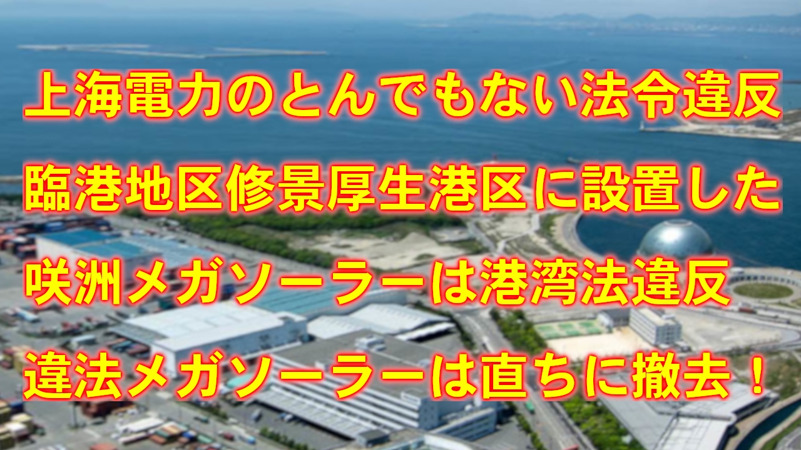
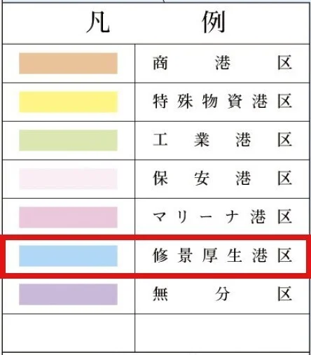
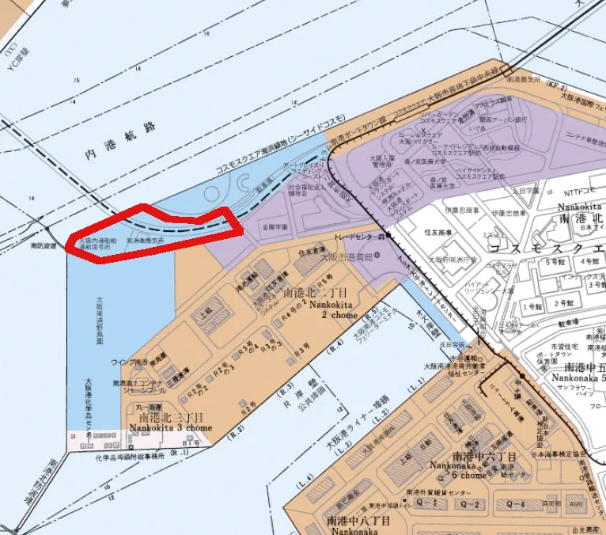
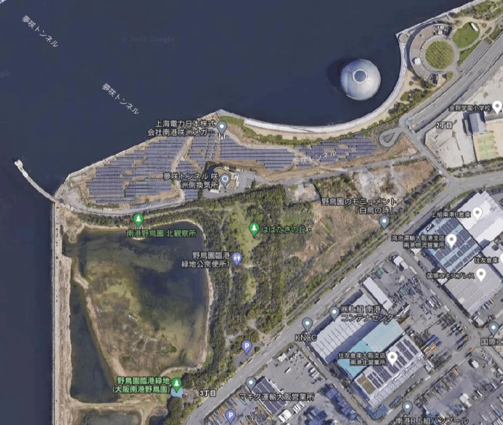
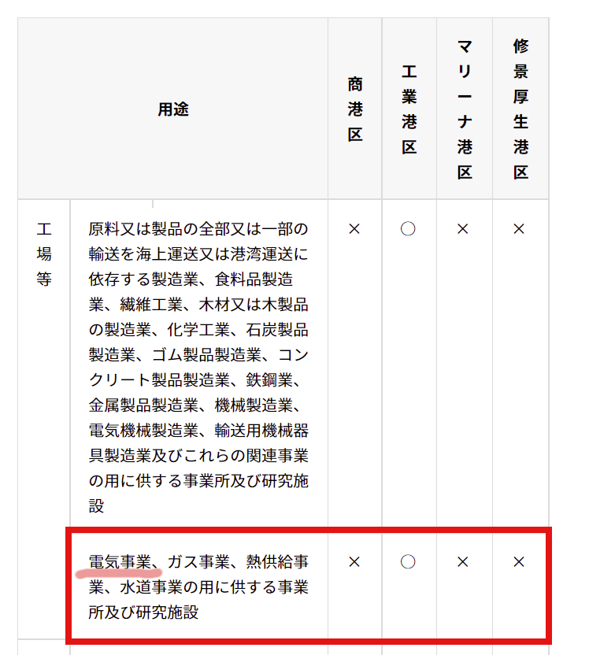

# 上海電力のとんでもない法令違反、臨港地区修景厚生港区に設置された上海電力咲洲メガソーラーは港湾法違反です  
  

この記事は note 記事を短くまとめたものです。詳細については以下の note 記事を参照してください

 
[上海電力問題　咲洲メガソーラーは大阪市条例違反　修景厚生港区に設置は出来ません　ただちに撤去を](https://note.com/okmksato/n/n579e9e16916e)

**咲洲メガソーラーの土地は港湾法における修景厚生港区（しゅうけいこうせいこうく）に指定されいて建造可能な建物などが厳しく制限されています**

**修景厚生港区**とは

[港湾法（臨港地区）第三十八条](https://elaws.e-gov.go.jp/document?lawid=325AC0000000218#Mp-At_38)  

>（臨港地区）
第三十八条　港湾管理者は、都市計画法第五条の規定により指定された都市計画区域以外の地域について**臨港地区**を定めることができる。

**臨港地区**はいくつかに分類された分区の一つで**第三十九条**に定められています  

[港湾法（臨港地区）第三十九条](https://elaws.e-gov.go.jp/document?lawid=325AC0000000218#Mp-At_39)

>（分区の指定）  
**十　修景厚生港区　その景観を整備するとともに、港湾関係者の厚生の増進を図ることを目的とする区域**  

**『修景厚生港区』の名前からわかるように、最も景観や環境に配慮が求められる区域です**  

大阪市の港湾地区の規制については

[大阪市ホームページ 臨港地区規制、まちづくり要綱等臨海部の規制について](https://www.city.osaka.lg.jp/port/page/0000440352.html)  

に資料がまとめられています  

地区の指定を資料の地図で確認します

[大阪港臨港地区分区図(PDF形式)](https://www.city.osaka.lg.jp/port/cmsfiles/contents/0000440/440352/bunkuzu20.pdf)

区分によって建築可能な港湾施設及び建設物が定められています

[建築可能な港湾施設及び建設物一覧(PDF形式)](https://www.city.osaka.lg.jp/port/cmsfiles/contents/0000440/440352/kenchiku.pdf)

**『修景厚生港区』では港湾施設以外では文化施設、必要最小限の商業施設など限られた建物のみ設置できません**

>図書館、博物館、水族館、展望施設、公衆浴 場（風営法第2条第6項第1号の営業の用に供するも のを除く）、遊技場、劇場（同項第3号の営業の 用に供するものを除く）、運動競技場及びその 附帯施設

などは修景厚生港区だけに許可されていて  

**修景厚生港区は市民の憩いの場として整備される事が想定されています**

**修景厚生港区に工場等の設置はできません**

神戸港のリストでは明確に修景厚生港区での電気事業施設の設置を禁止しています

[神戸港臨港地区内の構築物規制](https://www.city.kobe.lg.jp/a38702/business/kowanjigyo/yoko/kouchikubutsukisei.html)

**メガソーラーは修景厚生港区に建設できません**

**修景厚生港区の規制があまり知られていので、上海電力はとんでもない法令違反を犯し大阪市はそれを容認しています**

**港湾法違反の咲洲メガソーラーは直ちに撤去する事を求めます**
