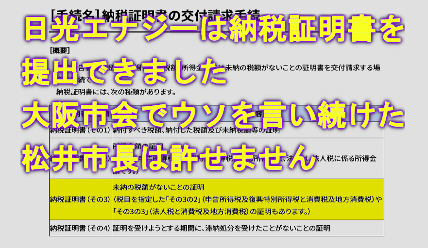
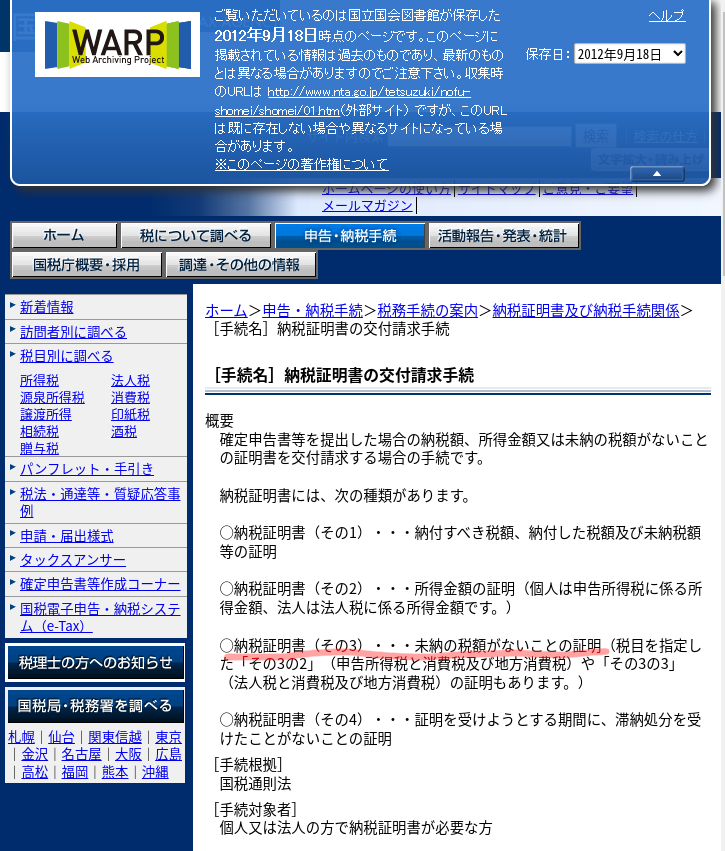
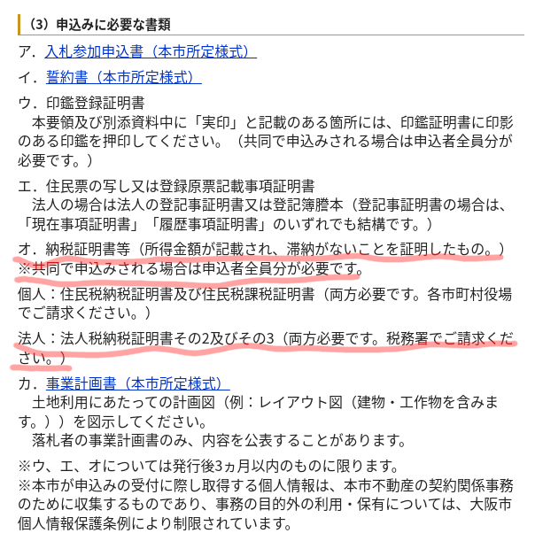

# 納税証明書は提出できたのに、日光エナジーの納税証明書提出が恣意的に免除されました
  
  

大阪市は

**『日光エナジーは設立してからの期間が短く納税証明書が発行できなかったから』**  

と説明していました

さらに、未提出でも問題がない理由として

**『納税証明書は滞納がないことを確認するのが目的であって、まだ納税する義務がない企業は証明が不要であるから』**

との趣旨の説明をしていました

しかし

『まだ納税する義務がない企業ある』

これを確認しなければなりません

そのような確認を行ったのでしょうか？

これを証明するのに必要情報は

- 会社の設立日
- 会社の決算日

[浅田会計事務所 １年でない決算](https://www.asadakaikei.co.jp/archives/8624)

でわかりやすく説明されています

>ところが嫌でも１年未満になることがあります。
それは設立事業年度で、設立日から定款に定める決算日までの期間を第１期とするので１年未満になるケースが多いです。

例えば、会社を設立して１０ヶ月であっても設立６ヶ月後が決算日であれば、会社の収益の状況によっては法人税の納税義務が発生している可能性があります

ですから

- 会社の設立日
- 会社の決算日

の確認は必要です

次に、もし例えば

- 会社の設立日が３ヶ月前
- 会社の決算日が６ヶ月後

のような場合、何も証明する書類を提出する必要はないのでしょうか

常識的に考えて、この日付を証明する何らかの書類等の提出が必要です  
口頭だけで提出免除はありえません

では、どのような書類の提出が必要でしょうか？

実はこのような場合も税務署で証明書を発行してもらえます

**納税証明書（その3）** です

[国税庁 納税証明書の交付請求手続 - WARP 保存 2012（H24）年9月18日](https://warp.da.ndl.go.jp/info:ndljp/pid/3533058/www.nta.go.jp/tetsuzuki/nofu-shomei/shomei/01.htm)

念の為、入札公告を確認します

[大阪市【太陽光発電事業限定】条件付一般競争入札による市有不動産の貸付実施要領](https://warp.ndl.go.jp/info:ndljp/pid/4019846/www.city.osaka.lg.jp/port/page/0000192063.html)

>オ．納税証明書等（所得金額が記載され、滞納がないことを証明したもの。）  
※共同で申込みされる場合は申込者全員分が必要です。  
　  
**法人：法人税納税証明書その2及びその3（両方必要です。税務署でご請求ください。）**

- **決算を迎えていない法人が納税証明書（その2）**
- **決算を迎えていない法人が納税証明書（その3）**

**この２種類の納税証明書が必要と明確に書かれています**

納税証明書（その3）については次のブログでわかりやすく説明されています

[許認可お役立ちブログ　書類の集め方｜これを読めば納税証明書もバッチリ取れる！](https://kurikuri-kyoninka.com/noueisyoumeisyo/#:~:text=%E6%96%B0%E8%A8%AD%E6%B3%95%E4%BA%BA%E3%81%AE%E5%A0%B4%E5%90%88%E3%81%AF%E8%AA%B2%E7%A8%8E%E5%AE%9F%E7%B8%BE%E3%81%8C%E3%81%AA%E3%81%84%E3%81%AE%E3%81%A7%E6%8F%90%E5%87%BA%E3%81%97%E3%81%AA%E3%81%8F%E3%81%A6%E3%82%82%E3%82%88%E3%81%95%E3%81%9D%E3%81%86%E3%81%A7%E3%81%99%E3%81%8C%E3%80%81%E6%8F%90%E5%87%BA%E3%81%97%E3%81%AA%E3%81%91%E3%82%8C%E3%81%B0%E3%81%AA%E3%82%8A%E3%81%BE%E3%81%9B%E3%82%93%E3%80%82%E7%9C%81%E7%95%A5%E3%81%A7%E3%81%8D%E3%81%BE%E3%81%9B%E3%82%93%E3%80%82%E8%A8%BC%E6%98%8E%E6%9B%B8%E3%81%AE%E5%82%99%E8%80%83%E6%AC%84%E3%81%AB%E3%80%8C%E7%94%B3%E5%91%8A%E7%B4%8D%E4%BB%98%E6%9C%9F%E9%99%90%E6%9C%AA%E5%88%B0%E6%9D%A5%E3%80%8D%E3%81%A8%E8%A8%98%E8%BC%89%E3%81%95%E3%82%8C%E3%81%A6%E7%99%BA%E8%A1%8C%E3%81%95%E3%82%8C%E3%82%8B%E3%81%AE%E3%81%A7%E3%80%81%E3%81%9D%E3%82%8C%E3%82%92%E6%8F%90%E5%87%BA%E3%81%97%E3%81%BE%E3%81%99%E3%80%82)

>**新設法人の場合は課税実績がないので提出しなくてもよさそうですが、提出しなければなりません。省略できません。証明書の備考欄に「申告納付期限未到来」と記載されて発行されるので、それを提出します。**

納税証明書（その3）によって「申告納付期限未到来」が証明され  
納税証明書（その2）が提出できない事の証明になります

**これで、書類不備が明確になりました**

**不正な行政手続きであったと認定し直ちに厳正な処置を取る必要があります**

**何よりも問題なのは、大阪市の関係者がこの様な事に気づかないはずがないと言うことです**

**松井市長は大阪市会でウソを言い続けてきたのです**

**橋下元市長もウソを言い続け、批判する方を罵倒してきました**

**私は絶対に許しません**
