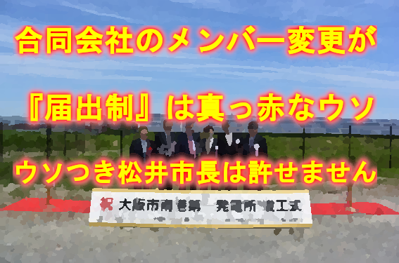
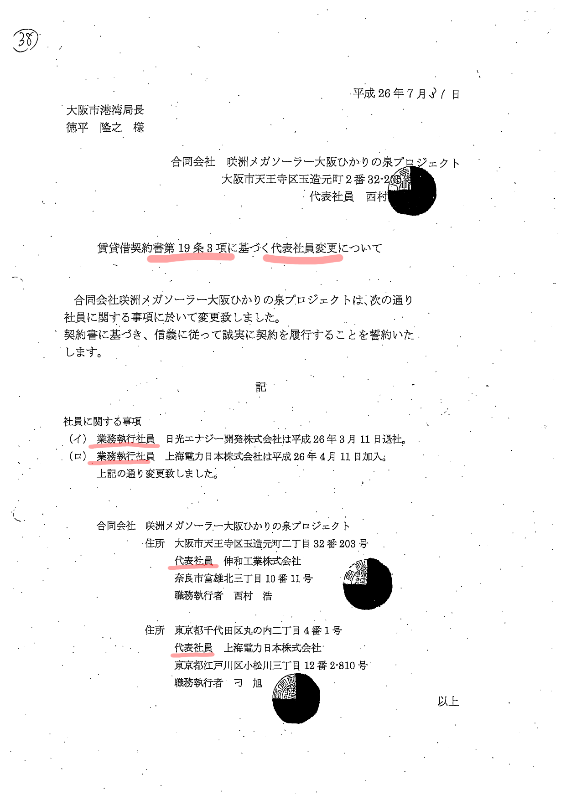
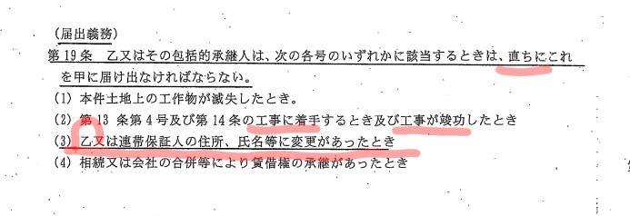
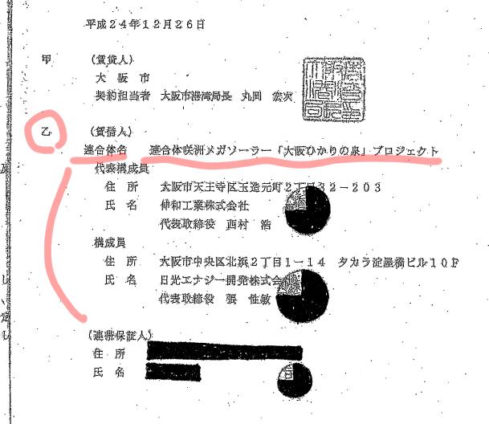
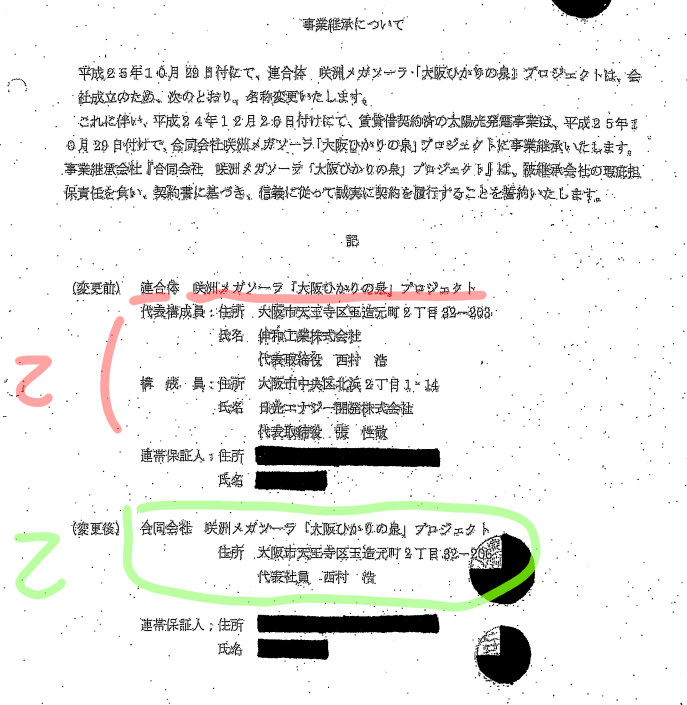

# 『合同会社のメンバー変更が届出制であった』は真っ赤なウソ - ウソつき松井市長は許せません  
  
  

松井市長は
大阪市会において

**『合同会社のメンバー変更が届出制であった』**  
**『届出制に問題であった』**  

と答弁していますが、これば全くの**ウソ**です

[大阪市  令和４年６月常任委員会（建設港湾）  06月10日－01号 松井市長答弁](https://ssp.kaigiroku.net/tenant/cityosaka/MinuteView.html?council_id=3436&schedule_id=2&minute_id=194&tab=list)

>問題点は、要は**途中で違う事業者が届出だけで入るのはおかしい**ということですか。届出だけで入るのは。  
　我々は、**今はルールとしては届出でメンバーを変更できるんです。**なぜそうしてるかというと、我々が求めてるのは、我々が規定したルールどおりに事業をしてもらうことです。

大阪市に提出された「届け出」を確認します

届け出のタイトルが**『賃貸借契約書第１９条３項』**に基づく**『代表社員変更』**となっていますので賃貸借契約を確認します

契約書では（届出義務）として  
**『乙』**の住所、氏名等に変更があったとき  
**直ちに**届け出なければならない  

とされています

契約締結時までさかのぼって**『乙』**を確認します

２０１２（Ｈ２４）年１２月２６日の入札後の契約書を確認します

次に、合同会社に事業継承した時の提出書類を確認します

つまり、合同会社に事業継承した時点で『乙』は

２０１２（Ｈ２４）年１２月２６日  
>乙（賃借人）  
連合体名　連合体咲洲メガソーラー「大阪ひかりの泉」プロジェクト  
代表構成員  
住所　大阪市天王寺区玉造元町２丁目３２−２０３  
氏名　伸和工業株式会社  
代表取締役　西村　浩  
構成員  
住所　大阪市中央区北浜２丁目１−１４　タカラ淀屋橋ビル１０Ｆ  
氏名　日光エナジー開発株式会社  
代表取締役　張　性敏  

から

２０１３（Ｈ２５）年１０月２９日  
>乙（賃借人）  
合同会社　咲洲メガソーラ「大阪ひかりの泉」プロジェクト  
住所　大阪市天王寺区玉造元町２丁目３２-２０３  
代表社員　西村　浩  

に変更となりました

合同会社になった時点で**『乙』**は、**代表社員のみ**となっていて**業務執行社員は届出をしていません**

そして、２０１４（Ｈ２６）年７月３１日に

**賃貸借契約書第１９条３項に基づく『代表社員変更について』**

のタイトルで届出が行われました

２０１４（Ｈ２６）年７月３１日    
>乙（賃借人）  
合同会社　咲洲メガソーラー大阪ひかりの泉プロジェクト  
住所　大阪市天王寺区玉造元町二丁目３２番２０３号  
代表社員　信和工業株式会社  
奈良市富雄北三丁目１０番１１号  
職務執行者　西村　浩  
住所　東京都千代田区丸の内二丁目４番１号  
代表社員　上海電力日本株式会社  
東京都江戸川区小松川３丁目１２番２−８１０号  
職務執行者　刁　旭  

ですから合同会社への継承以降は、『合同会社の名称』、『代表社員の名称』、『住所』の変更があれば届け出を行う取り決めになっていたに過ぎません  

**業務執行社員など**代表社員以外の社員が変更になった場合の届け出についてのルールは定められていません

>社員に関する事項  
（イ）業務執行社員　日光エナジー開発株式会社は平成２６年３月１１日退社。  
（ロ）業務執行社員　上海電力日本株式会社は平成２６年４月１１日加入。  
上記の通り変更いたしました  

この業務執行社員に関する事項は**『代表社員変更』**の届け出のついでに自主的に報告されたに過ぎません

**松井市長は大阪市会に於いて、不正な手続きをごまかすために、「届出制」が問題であったとウソの説明をしました**  

**大阪市会でウソをつく松井市長は絶対に許されません**

[2022-10-10 追加]  
合同会社の役員については以下のサイトを参考にしてください  

[freee株式会社 合同会社の「代表社員」は複数いてもいい？  
業務執行社員との違いも詳しく解説 - 業務執行社員と代表社員の位置づけ](https://www.freee.co.jp/kb/kb-launch/representative-partner/#content2-2)

『合同会社　咲洲メガソーラ「大阪ひかりの泉」プロジェクト』は『業務執行社員が複数いる場合』があてはまります

**資料**  
[大阪市会録画配信 建設港湾委員会 令和4年6月10日午後1時資料](http://osaka.gijiroku.com/g07_Video2_View.asp?SrchID=1793)  
[添付資料前田和彦委員配付資料 (PDF 3,260KB)](http://osaka.gijiroku.com/voices/GikaiDoc/attach/Nittei/Nt1792_20220610maeda.pdf)
