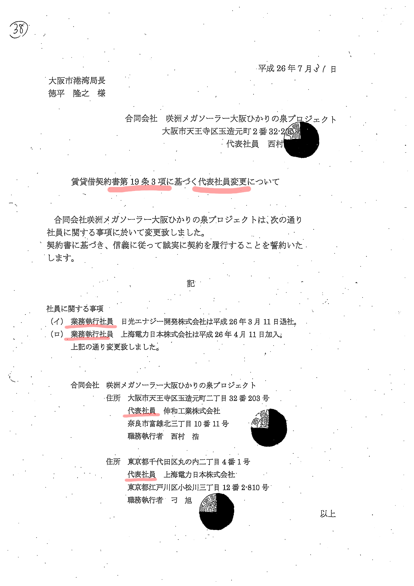
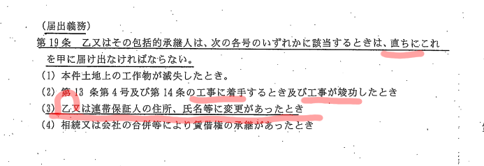
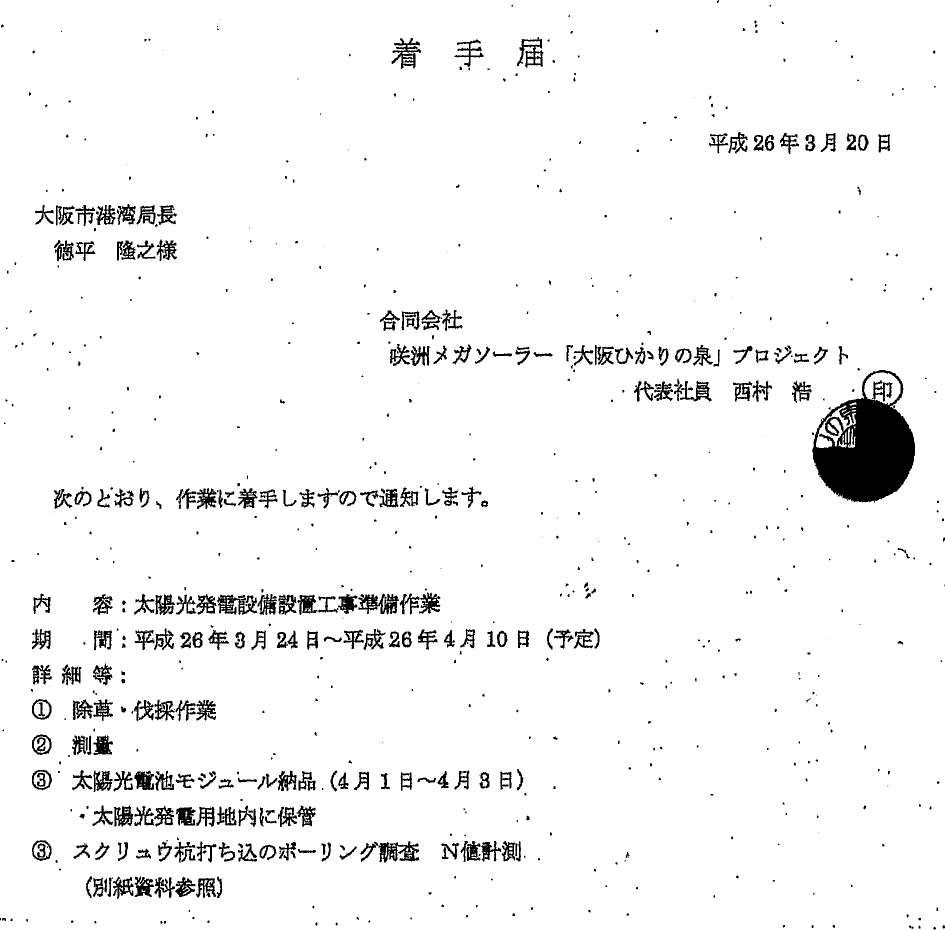

# 『届出制に問題があった』は松井市長の真っ赤なウソ - まともな『届出』はされていません  
  
  

松井市長は
大阪市会において

**『合同会社のメンバー変更が届出制であった』**  
**『届出制に問題であった』**  

と答弁していますが、これは全くの**ウソ**です

[大阪市  令和４年６月常任委員会（建設港湾）  06月10日－01号 松井市長答弁](https://ssp.kaigiroku.net/tenant/cityosaka/MinuteView.html?council_id=3436&schedule_id=2&minute_id=194&tab=list)

再度、大阪市に提出された「届け出」を確認します

賃貸借契約も再度確認します

契約書では（届出義務）として  
**『乙』**の住所、氏名等に変更があったとき  
**直ちに**届け出なければならない  

とされています

**直ちに**届け出がされているでしょうか？

届出がされたのは

**２０１４（Ｈ２６）年７月３１日**  

届出の内容は

**２０１４（Ｈ２６）年３月１１日**　日光エナジー開発退社  
▶ 日光エナジー開発退社から**４ヶ月以上後**  

**２０１４（Ｈ２６）年４月１１日**　上海電力日本加入  
▶ 上海電力日本加入から**３ヶ月以上後**  

これでは、とてもではありませんが届出がされたとは言えません  

また、契約書の第１９条（３）は

>（３）第１３条第４号及び第１４条の工事に着手するとき及び工事が竣功したとき

と定められていますが  

**２０１４（Ｈ２６）年３月２４日〜４月１０日**の準備作業の着手届が

**２０１４（Ｈ２６）年３月２０日**に提出されています

この時点において、日光エナジー開発はすでに退社していますが、着手届では、その事は報告されていません  
また、規約に沿って届出が行われていれば  

**２０１４（Ｈ２６）年４月１１日**以降の工作物の設置作業の開始  
**２０１４（Ｈ２６）年５月１８日**の竣工  

も大阪市に届出されたはずです

しかし、その時点では合同会社の執行社員の変更は報告されず  

**２０１４（Ｈ２６）年７月３１日**になってようやく報告されました  

この事からも、日光エナジー開発の退社、上海電力日本の加入については、そもそも届け出るつもりはなく、竣工式等でマスコミの取材を受け慌ててアリバイ的に後付で「事後報告」がされたに過ぎません

松井市長の言う**届け出**もまともに行われていなかったのです

**届け出制であったと言うのもウソ**  
**届け出がされていたと言うのもウソ**

**大阪市会でウソを並べるウソつき松井市長は絶対に許されません**

**資料**  
[大阪市会録画配信 建設港湾委員会 令和4年6月10日午後1時資料](http://osaka.gijiroku.com/g07_Video2_View.asp?SrchID=1793)  
[添付資料前田和彦委員配付資料 (PDF 3,260KB)](http://osaka.gijiroku.com/voices/GikaiDoc/attach/Nittei/Nt1792_20220610maeda.pdf)
