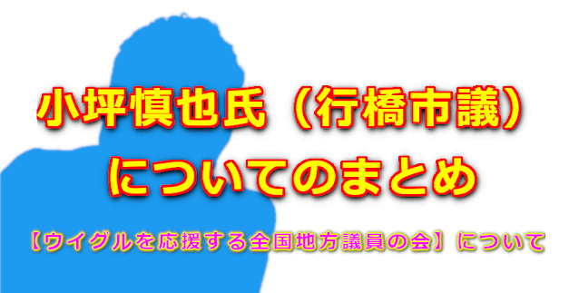

###### MINO さん [@DragonCombo777](https://twitter.com/MINO70635329)

>###### [【ウイグルを応援する全国地方議員の会】について](https://twitter.com/MINO70635329/status/1482342093909794816)

<blockquote class="twitter-tweet" data-conversation="none">
【ウイグルを応援する全国地方議員の会】  ②請願書への難癖。特定ウイグル人への誹謗中傷。  提出の仕方が悪い。アドバイスを聞かない。ウイグル人をテロリスト扱い。国会採決の妨害行為とまで言ってのける。(先の機関紙も利用)  アドバイスした人物の失態。 アドバイスした人物(以下タコラ) の↓
— MINO (@MINO70635329) <a href="https://twitter.com/MINO70635329/status/1482342097332359168?ref_src=twsrc%5Etfw">January 15, 2022</a></blockquote> 

<blockquote class="twitter-tweet" data-conversation="none">
特定ウイグル人への恨み。 タコラはある団体から破門。 その団体はその特定ウイグル人(以下マリオ)を昔から支援。  ③ウイグル協会、漫画家Sを請願提出者(以下Mこん)マリオからの引き離しに動く輩。  ウイグル協会、S、Mこん、は当初一緒に活動。そこへ幸せな宗教家達が加わる。  それを見た輩が ↓
— MINO (@MINO70635329) <a href="https://twitter.com/MINO70635329/status/1482342099232391169?ref_src=twsrc%5Etfw">January 15, 2022</a></blockquote> 

<blockquote class="twitter-tweet" data-conversation="none">
Sのキャラクターが奪われ政治利用されると危惧し引き離しにかかる。そして自分達のモノにしようと。  Mこんと幸せな宗教は繋がってるとウイグル協会やSに吹き込む。  ラビア女史来日を幸せが支援、マリオが女史と幸せの人とを会わせた。  (ラビア女史は先述した団体が本来は支援。この一騒動に乗じて↓
— MINO (@MINO70635329) <a href="https://twitter.com/MINO70635329/status/1482342100855586823?ref_src=twsrc%5Etfw">January 15, 2022</a></blockquote> 

<blockquote class="twitter-tweet" data-conversation="none">
タコラがラビア女史に取り入る。)  この様な情報を協会、Sに吹き込み引き離しに成功。(その内容は本人の尊厳を守る為、黙ってて。とか言って。)  ④結果。  協会、SはMこんさんはおろか、引き継いで活動している方々にも一切協力せず。 Sのキャラクターは100条市議が代表を務める、なんとかカルチャー
— MINO (@MINO70635329) <a href="https://twitter.com/MINO70635329/status/1482342102394892290?ref_src=twsrc%5Etfw">January 15, 2022</a></blockquote> 

<blockquote class="twitter-tweet" data-conversation="none">
がゲット。 5円が1000円にゆうパックが普通郵便にという、錬金術。  ⑤因果応報  タコラ逮捕。100条設置。被害届。 ヤラセ疑惑。
— MINO (@MINO70635329) <a href="https://twitter.com/MINO70635329/status/1482342106215886858?ref_src=twsrc%5Etfw">January 15, 2022</a></blockquote> 

<blockquote class="twitter-tweet" data-conversation="none">
ウイグルを応援する全国地方議員の会は本当にウイグルの事を考えてるのか？真剣に考えている議員もいるだろうが、売名・利権を考えて活動している議員が中心、立ち上げに関わっている様に思える。何かにつけてウイグル〜の会を全面に出す人物。  ＊請願書時に遡る
— MINO (@MINO70635329) <a href="https://twitter.com/MINO70635329/status/1484172282948108288?ref_src=twsrc%5Etfw">January 20, 2022</a></blockquote> 

<blockquote class="twitter-tweet" data-conversation="none">
＊請願書時に遡る  長尾氏、タコラが関わった当初、署名は1万にも満たなかった。軽く考えていたのだろう。 適当に相手して、なんなら預かってきな。くらいに。 だから自身でコンタクト取ることをせずに、タコラの様な人望のない活動家をお使いに立てた。
— MINO (@MINO70635329) <a href="https://twitter.com/MINO70635329/status/1484172718614650885?ref_src=twsrc%5Etfw">January 20, 2022</a></blockquote> 

<blockquote class="twitter-tweet" data-conversation="none">
タコラもどーせ通らないと、軽く考えて、請願の事より自分の自慢話に終始する。  しかしその後、幸せなユーチューバーが拡散、旋風を巻き起こした。 そして5万超の署名を集め国会議員に提出。  ここで、過程がどうであれ提出された事実を鑑み、全力で応援し世論を盛り
— MINO (@MINO70635329) <a href="https://twitter.com/MINO70635329/status/1484172945006415876?ref_src=twsrc%5Etfw">January 20, 2022</a></blockquote> 

<blockquote class="twitter-tweet" data-conversation="none">
上げるのが、ウイグルを応援する者がやるべき事。時は国会開催中。 しかしタコラとその盟友の市議は自民議員の太鼓持ち。幸せな政党も絡んで幸せな政党の評価もうなぎ上り、そのことも有り、請願に難癖をつけ始める。(署名は幸せな団体に利用されると)  市議は後に署名活動を妨害はしていな
— MINO (@MINO70635329) <a href="https://twitter.com/MINO70635329/status/1484173109674803207?ref_src=twsrc%5Etfw">January 20, 2022</a></blockquote> 

<blockquote class="twitter-tweet" data-conversation="none">
い。騒いだのは提出後だ。とはぐらかす。 その提出後の国会中が大事なはず。  あのタイミングで発信した事でこの市議やあの会はウイグルの事を本気で考えてないんだなと思った。  確か請願提出者の質問にも、邪魔はしてない、事実を述べた、提言書は訂正する事はない。と言ってたはず。
— MINO (@MINO70635329) <a href="https://twitter.com/MINO70635329/status/1484173264285212674?ref_src=twsrc%5Etfw">January 20, 2022</a></blockquote> 

<blockquote class="twitter-tweet" data-conversation="none">
今しれっと会の項目から削除。自身のブログも削除。何の説明も無し。  最近は地元の事を何もしていない。全国的に注目を集める問題にいっちょかみ。とチラホラ声が出てきたので、チョロっと地元の事も書き始めた。(本気でないので内容は伝わらないが)  【結論】
— MINO (@MINO70635329) <a href="https://twitter.com/MINO70635329/status/1484173404446289922?ref_src=twsrc%5Etfw">January 20, 2022</a></blockquote> 

<blockquote class="twitter-tweet" data-conversation="none">
市議・政治家という肩書を得た活動家。  肩書を外してぇーな ん？私は誰の事書いてるのか？ あくまで私の主観です。
— MINO (@MINO70635329) <a href="https://twitter.com/MINO70635329/status/1484173457269334017?ref_src=twsrc%5Etfw">January 20, 2022</a></blockquote> 

<blockquote class="twitter-tweet" data-conversation="none">
なんなの？ウイグルを応援する全国地方議員の会って！  提言書しれっと削除。 会長辞任。 問い合わせフォームあるも何度問い合わせても回答なし。 削除、辞任何の告知もなし。  提言書の関係者は知らんぷり。  単なる売名活動の為の看板だな。 <a href="https://t.co/YjJ7fIDhdF">https://t.co/YjJ7fIDhdF</a>
— MINO (@MINO70635329) <a href="https://twitter.com/MINO70635329/status/1485885629947080704?ref_src=twsrc%5Etfw">January 25, 2022</a></blockquote> 

<blockquote class="twitter-tweet" data-conversation="none">
こんな市議達に売名の為利用されてるウイグル問題。 分断しようが、炎上しようが目立てばいいと思ってる連中。  ほんと、幸福の科学とかが議席を取って一気に盛り上げてもらいたい。  保守受けするパフォーマンスが最近は白々しく鼻につく🤧  提言書の事と下記の捏造ツイートは許さない。 <a href="https://t.co/8URptYc4aC">pic.twitter.com/8URptYc4aC</a>
— MINO (@MINO70635329) <a href="https://twitter.com/MINO70635329/status/1485989623054893059?ref_src=twsrc%5Etfw">January 25, 2022</a></blockquote> 

<blockquote class="twitter-tweet" data-conversation="none">
<a href="https://t.co/S6uEYv7BEf">https://t.co/S6uEYv7BEf</a>
&mdash; MINO (@MINO70635329) <a href="https://twitter.com/MINO70635329/status/1531603084518260737?ref_src=twsrc%5Etfw">May 31, 2022</a></blockquote> 

<blockquote class="twitter-tweet" data-conversation="none">
今読み返すと、タコラとか変な名前が出てて、すげ〜分かりにくい😅  補足です。 <a href="https://t.co/NFOpWRckfr">https://t.co/NFOpWRckfr</a>
&mdash; MINO (@MINO70635329) <a href="https://twitter.com/MINO70635329/status/1555544424532557824?ref_src=twsrc%5Etfw">August 5, 2022</a></blockquote> 

<blockquote class="twitter-tweet" data-conversation="none">
なんかよく分からない人達だそうです。 (今のフォロワーさん向けには)  影のツイート引用して、分かってるよ。と伝えたいみたいです。  皆んなに言えばいいのに。  では私。 昨年のウイグル人権法の請願署名に参加し、その際この市議に(私的には)無茶苦茶にされたと思っている者です。  ↓↓↓ <a href="https://t.co/YmAMhCVuI5">pic.twitter.com/YmAMhCVuI5</a>
&mdash; MINO (@MINO70635329) <a href="https://twitter.com/MINO70635329/status/1554755035975733249?ref_src=twsrc%5Etfw">August 3, 2022</a></blockquote> 

<blockquote class="twitter-tweet" data-conversation="none">
固定ツイート読んで頂ければ分かると思いますが、その際メディアや人権を扱っている著名人を巻き込んで公式に発表した提言書。 提出者や特定のウイグル人を貶める内容だと感じました。 提出者が何度質問を投げかけるも、スルー。会長に至っては迷惑だ、2度と連絡してくるな！の返答。 ↓↓↓
&mdash; MINO (@MINO70635329) <a href="https://twitter.com/MINO70635329/status/1554755287277416448?ref_src=twsrc%5Etfw">August 3, 2022</a></blockquote> 

<blockquote class="twitter-tweet" data-conversation="none">
この時この市議は警察案件だ！という言葉を用い恫喝か？とも思われる投稿をしました。内容を本人、相手方の返信メール等確認すると、捏造だと思われる内容でした。 で、その後提出者の被害届が効いたのか、 ↓↓↓
&mdash; MINO (@MINO70635329) <a href="https://twitter.com/MINO70635329/status/1554755623555805184?ref_src=twsrc%5Etfw">August 3, 2022</a></blockquote> 

<blockquote class="twitter-tweet" data-conversation="none">
提言書作成に関わった活動家の強制わいせつ逮捕、が効いたのか分からないが、提言書をしれっと削除。 私的には提言書削除の理由、警察案件の説明、特定ウイグル人をテロリスト扱いした事の説明。 これがされるまでは、この市議を知らない人への注意喚起を兼ねて発信を続けます。
&mdash; MINO (@MINO70635329) <a href="https://twitter.com/MINO70635329/status/1554755938602471424?ref_src=twsrc%5Etfw">August 3, 2022</a></blockquote> 

<blockquote class="twitter-tweet" data-conversation="none">
福岡のFMラジオでも<a href="https://twitter.com/hashtag/%E3%82%A6%E3%82%A4%E3%82%B0%E3%83%AB%E3%82%92%E5%BF%9C%E6%8F%B4%E3%81%99%E3%82%8B%E5%85%A8%E5%9B%BD%E5%9C%B0%E6%96%B9%E8%AD%B0%E5%93%A1%E3%81%AE%E4%BC%9A?src=hash&amp;ref_src=twsrc%5Etfw">#ウイグルを応援する全国地方議員の会</a> についてお話されています川井 正彦氏のブログもご参照ください🙇 「いつから政治家は上級市民に成り果てたか」 （他にもこの件の記事がたくさんあります。）<a href="https://t.co/EW14Wkhsue">https://t.co/EW14Wkhsue</a>
&mdash; 川十郎 (@take55furukabu) <a href="https://twitter.com/take55furukabu/status/1554877111789166592?ref_src=twsrc%5Etfw">August 3, 2022</a></blockquote> 

###### [先頭に戻る](#top)
  