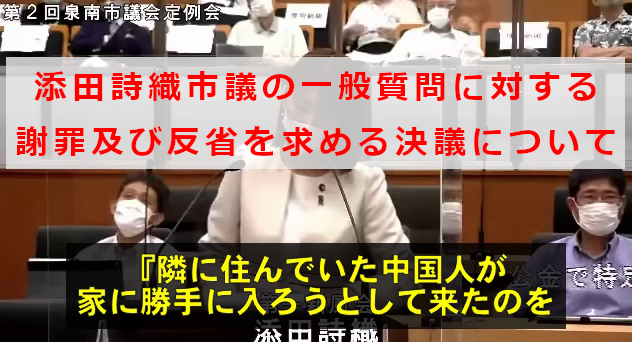
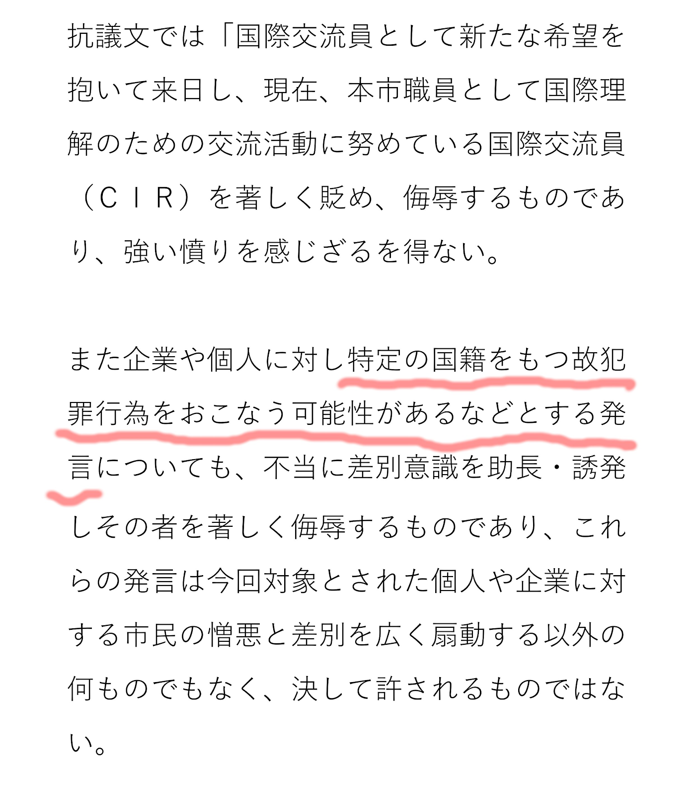

2022年7月6日  
泉南市議会定例会での添田詩織議員の一般質問における、最も問題と思われる「犯罪」について言及した部分  
添田詩織議員一般質問　令和4年第2回定例会（泉南市議会）38分30秒～

<iframe allow="accelerometer; autoplay; clipboard-write; encrypted-media; gyroscope; picture-in-picture" allowfullscreen="" frameborder="0" height="180" src="https://www.youtube.com/embed/wPcXS9wqHWw" title="YouTube video player" width="320"></iframe>

 

2022年7月26日  
泉南市議会定例会での添田詩織議員の一般質問に対し、謝罪及び反省を求める決議関連資料  
での『犯罪行為発言』に触れた箇所  

 

2022年7月6日  
添田詩織議員一般質問（ノーカット）　令和4年第2回定例会（泉南市議会）38分30秒～

<iframe allow="accelerometer; autoplay; clipboard-write; encrypted-media; gyroscope; picture-in-picture" allowfullscreen="" frameborder="0" height="180" src="https://www.youtube.com/embed/Oxx5IQdks1M?start=2310" title="YouTube video player" width="320"></iframe>

  
 

2022年7月6日  
添田詩織議員一般質問①　人権講座について

<iframe width="320" height="180" src="https://www.youtube.com/embed/StX8mtdd4cQ" title="YouTube video player" frameborder="0" allow="accelerometer; autoplay; clipboard-write; encrypted-media; gyroscope; picture-in-picture" allowfullscreen></iframe>

 

2022年7月6日  
添田詩織議員一般質問②　教育現場における国歌、国旗の扱いについて

<iframe width="320" height="180" src="https://www.youtube.com/embed/LHLIT71oGnM" title="YouTube video player" frameborder="0" allow="accelerometer; autoplay; clipboard-write; encrypted-media; gyroscope; picture-in-picture" allowfullscreen></iframe>

 

2022年7月6日  
添田詩織議員一般質問③　教員の政治的活動について

<iframe width="320" height="180" src="https://www.youtube.com/embed/oCjSTBqXe5g" title="YouTube video player" frameborder="0" allow="accelerometer; autoplay; clipboard-write; encrypted-media; gyroscope; picture-in-picture" allowfullscreen></iframe>

 

2022年7月26日  
『泉南市議会定例会での添田詩織議員の一般質問に対し、謝罪及び反省を求める決議』全文読上げ動画

<iframe allow="accelerometer; autoplay; clipboard-write; encrypted-media; gyroscope; picture-in-picture" allowfullscreen="" frameborder="0" height="320" src="https://www.youtube.com/embed/cFVnfBsEN6U" title="YouTube video player" width="320"></iframe>

 

2022年7月6日  
[泉南市議会定例会での添田詩織議員の一般質問に対し、謝罪及び反省を求める決議関連資料（PDF）](http://gikai.city.sennan.osaka.jp/wp-content/uploads/ketsugi_soedagiin_giketsukekka.pdf)

小坪慎也行橋市市議は twitter において  
添田市議は本人が行き過ぎだと思った発言について  
議長に申し出を行い、発言の一部が議事録から削除される見込みであると述べています  

<blockquote class="twitter-tweet" data-conversation="none">
そのことは、田畑議長が議場で采配しているように、議長の手腕という部分もある。それもblogに書いてる。  私が論点としている部分には、「全ての議事録を残せ」とは主張していない点は行間を読んでください。議事録として削られるであろう文言はあるし、そこは議長と話はしています。  （続
— 小坪慎也@行橋市議（トレンド１位） (@kotsubo48) <a href="https://twitter.com/kotsubo48/status/1553325098266148864?ref_src=twsrc%5Etfw">July 30, 2022</a></blockquote> 

<blockquote class="twitter-tweet" data-conversation="none">
その上で、この決議はおかしい！議事録に全てを残すか否かではなく、本人がのちに行き過ぎだと思えば質問者の議員の申し出、または議長の権限で議事録から削ることは会議則としては可能です。  それも否定していません。 （続
— 小坪慎也@行橋市議（トレンド１位） (@kotsubo48) <a href="https://twitter.com/kotsubo48/status/1553325503138131968?ref_src=twsrc%5Etfw">July 30, 2022</a></blockquote> 
 

泉南市議会議員竹田光良氏のホームページによると『添田議員より、一般質問で発言した内容の一部を取り消したいとの意向』があり、一部が取り消されたようです  

2022年7月6日  
[泉南市議会議員竹田光良氏のホームページ](https://www.komei.or.jp/km/sennan-takeda-mitsuyoshi/2022/07/27/)

「7/26最終本会議（午前）令和4年第2回定例会（泉南市議会）」より添田詩織議員から発言取消し意向の関連をピックアップした動画  

<blockquote class="twitter-tweet" data-conversation="none">
「7/26最終本会議（午前）令和4年第2回定例会（泉南市議会）」より<a href="https://twitter.com/hashtag/%E6%B7%BB%E7%94%B0%E8%A9%A9%E7%B9%94?src=hash&amp;ref_src=twsrc%5Etfw">#添田詩織</a> 議員から発言取消し意向の関連をピックアップ。 「添田詩織議員から7月7日の一般質問における～（省略）～発言取り消したい旨の申し出がありました」 <a href="https://t.co/yPuulLHwZn">pic.twitter.com/yPuulLHwZn</a>
— 川十郎 (@take55furukabu) <a href="https://twitter.com/take55furukabu/status/1557331242634592257?ref_src=twsrc%5Etfw">August 10, 2022</a></blockquote> 

<blockquote class="twitter-tweet" data-conversation="none">
令和4年第2回定例会（泉南市議会） の添田詩織市議の発言削除についての議長説明の冒頭部分です <a href="https://t.co/9tRiSUrjHQ">pic.twitter.com/9tRiSUrjHQ</a>
— エスゾピクロン (@okmksato) <a href="https://twitter.com/okmksato/status/1557320986785382401?ref_src=twsrc%5Etfw">August 10, 2022</a></blockquote> 
 

最終本会議（午前）　令和4年第2回定例会（泉南市議会）YouTube ノーカット版
<iframe allow="accelerometer; autoplay; clipboard-write; encrypted-media; gyroscope; picture-in-picture" allowfullscreen="" frameborder="0" height="180" src="https://www.youtube.com/embed/jqp9AOxet9g" title="YouTube video player" width="320"></iframe>
 

最終本会議（午後）　令和4年第2回定例会（泉南市議会）  
泉南市議会添田市議の発言取消承認議決
<iframe allow="accelerometer; autoplay; clipboard-write; encrypted-media; gyroscope; picture-in-picture" allowfullscreen="" frameborder="0" height="180" src="https://www.youtube.com/embed/YMcGUuNN24A" title="YouTube video player" width="320"></iframe>
 

泉南市議会添田市議の発言取消承認決議後の議長の発言
<iframe allow="accelerometer; autoplay; clipboard-write; encrypted-media; gyroscope; picture-in-picture" allowfullscreen="" frameborder="0" height="180" src="https://www.youtube.com/embed/TdI7ITE-J-g" title="YouTube video player" width="320"></iframe>
 

泉南市議会における添田市議に謝罪及び反省を求める決議についての議論
<iframe allow="accelerometer; autoplay; clipboard-write; encrypted-media; gyroscope; picture-in-picture" allowfullscreen="" frameborder="0" height="180" src="https://www.youtube.com/embed/1nwTlEwC4Iw" title="YouTube video player" width="320"></iframe>
 

最終本会議（午後）　令和4年第2回定例会（泉南市議会）ノーカット版
<iframe allow="accelerometer; autoplay; clipboard-write; encrypted-media; gyroscope; picture-in-picture" allowfullscreen="" frameborder="0" height="180" src="https://www.youtube.com/embed/DFAqu1SwuOU" title="YouTube video player" width="320"></iframe>
